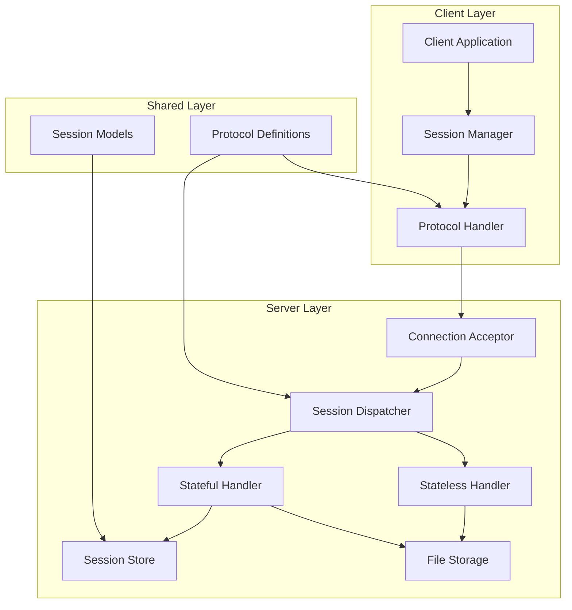
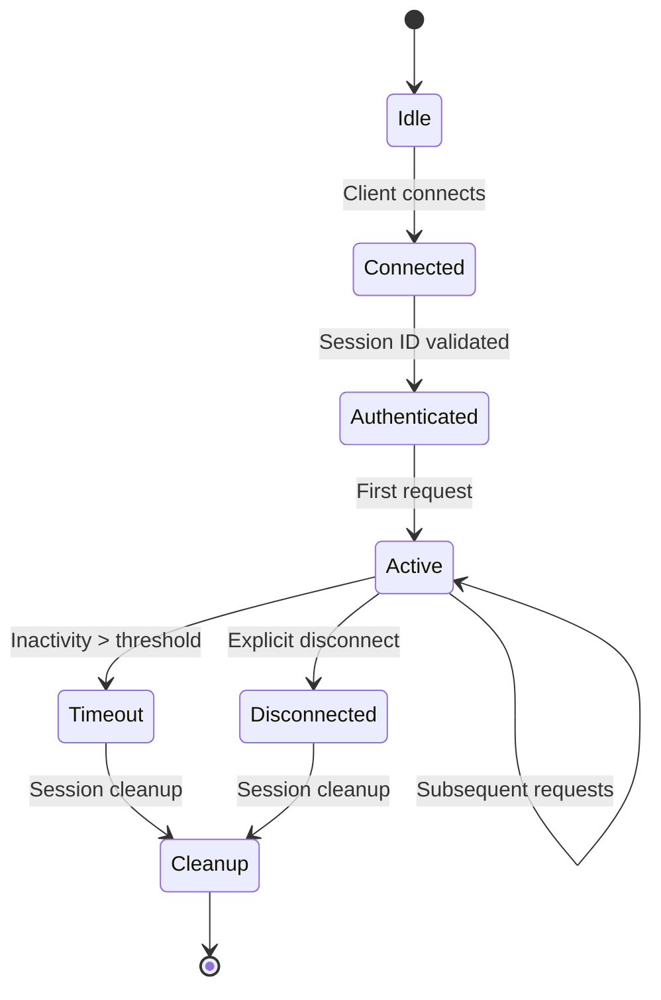

# Week 02 Stateless vs Stateful Implementation Plan

## 1. Project Overview

### 1.1 Objectives
Week 02 builds upon the Week 01 MIME-typing file transfer system by introducing explicit Session Layer concepts. The primary objectives are:

1. **Understand Session Layer Responsibility**: Move from implicit connection-state to explicit session-state management
2. **Implement Dual-Mode Operation**: Modify the existing server to support both stateless and stateful interaction modes
3. **Demonstrate State Management**: Explicitly track session identifiers, message counts, and client identity
4. **Analyze Trade-offs**: Observe scalability, failure impact, and complexity differences between stateless and stateful approaches

### 1.2 Relationship to Week 01
Week 01 established a basic TCP-based file transfer system with:
- MIME-type aware packet formatting
- Simple client-server communication
- File storage with automatic extension mapping

Week 02 extends this foundation by:
- Adding session awareness to the protocol
- Implementing state persistence across multiple requests
- Creating configurable interaction modes (stateless/stateful)
- Introducing session timeout and cleanup mechanisms

### 1.3 Core Learning Outcomes
Students will learn:
- The distinction between TCP connection-state and application session-state
- How to design protocols that explicitly manage conversation context
- The architectural trade-offs between stateless and stateful systems
- Practical implementation of session tracking and cleanup

## 2. Architecture Design

### 2.1 System Components



### 2.2 Component Responsibilities

#### 2.2.1 Client Components
- **Client Application**: User interface for file selection and transfer initiation
- **Session Manager**: Maintains client-side session state and handles reconnection logic
- **Protocol Handler**: Encodes/decodes messages according to the enhanced protocol

#### 2.2.2 Server Components
- **Connection Acceptor**: Listens for incoming TCP connections
- **Session Dispatcher**: Routes requests to appropriate handler based on session mode
- **Stateless Handler**: Processes requests without maintaining any client state
- **Stateful Handler**: Maintains session context across multiple requests
- **Session Store**: In-memory storage for active sessions with timeout management
- **File Storage**: Persists received files with session-aware naming

#### 2.2.3 Shared Components
- **Protocol Definitions**: Enhanced packet format with session metadata
- **Session Models**: Data structures for session tracking and management

### 2.3 Data Flow

#### 2.3.1 Stateless Mode
```
Client → Server: [Header + Payload]
Server → Client: [Acknowledgment]
(Connection may close after each request)
```

#### 2.3.2 Stateful Mode
```
Client → Server: [CONNECT + Session ID]
Server → Client: [SESSION_CREATED + Session ID]
Client → Server: [Multiple requests with Session ID]
Server → Client: [Responses with updated session state]
Client → Server: [DISCONNECT]
Server → Client: [SESSION_CLOSED]
```

### 2.4 Session Management Architecture



## 3. Implementation Phases

### Phase 1: Protocol Enhancement (Week 2.1)
**Duration**: 2 days
**Deliverables**:
1. Enhanced protocol specification with session fields
2. Updated `shared/protocol.py` with session-aware packet formatting
3. Backward compatibility tests

**Tasks**:
- [ ] Define session metadata fields (session_id, sequence_number, mode_flag)
- [ ] Extend packet header to include session information
- [ ] Create session establishment and termination message types
- [ ] Implement protocol version negotiation

### Phase 2: Server Refactoring (Week 2.2)
**Duration**: 3 days
**Deliverables**:
1. Modular server architecture with handler abstraction
2. Configurable stateless/stateful mode selection
3. Basic session tracking implementation

**Tasks**:
- [ ] Refactor server into connection dispatcher pattern
- [ ] Create abstract `RequestHandler` interface
- [ ] Implement `StatelessHandler` class
- [ ] Implement `StatefulHandler` class with in-memory session store
- [ ] Add configuration system for mode selection

### Phase 3: Client Enhancement (Week 2.3)
**Duration**: 2 days
**Deliverables**:
1. Session-aware client application
2. Automatic session management
3. Reconnection logic for stateful mode

**Tasks**:
- [ ] Extend client to support session establishment
- [ ] Implement session persistence across multiple file transfers
- [ ] Add automatic reconnection with session resumption
- [ ] Create client configuration for mode selection

### Phase 4: Advanced Features (Week 2.4)
**Duration**: 3 days
**Deliverables**:
1. Session timeout and cleanup
2. Session persistence to disk
3. Load balancing support for stateless mode

**Tasks**:
- [ ] Implement session timeout detection and cleanup
- [ ] Add session persistence to SQLite database
- [ ] Create session migration capability for load balancing
- [ ] Implement graceful degradation from stateful to stateless mode

### Phase 5: Testing and Validation (Week 2.5)
**Duration**: 2 days
**Deliverables**:
1. Comprehensive test suite
2. Performance benchmarks
3. Documentation and examples

**Tasks**:
- [ ] Create unit tests for all components
- [ ] Implement integration tests for both modes
- [ ] Conduct performance comparison tests
- [ ] Create user documentation and API reference

## 4. Technical Specifications

### 4.1 Enhanced Protocol Format

#### 4.1.1 Packet Structure
```
+----------------+----------------+----------------+----------------+
|  Header JSON   |    Newline     |  Session Data  |  Payload Data  |
|  (UTF-8)       |  (0x0A)        |  (Optional)    |  (Binary)      |
+----------------+----------------+----------------+----------------+
```

#### 4.1.2 Header Fields
```json
{
  "version": "2.0",
  "mime_type": "image/png",
  "size": 1024,
  "session": {
    "id": "uuid-v4-or-null",
    "mode": "stateless|stateful",
    "sequence": 1,
    "action": "connect|transfer|disconnect"
  }
}
```

#### 4.1.3 Session Actions
- `connect`: Establish new session (stateful mode only)
- `transfer`: Data transfer with optional session context
- `disconnect`: Graceful session termination
- `heartbeat`: Keep-alive for stateful sessions

### 4.2 Server Configuration

#### 4.2.1 Configuration File (`server/config.yaml`)
```yaml
server:
  host: "127.0.0.1"
  port: 65432
  mode: "dual"  # stateless, stateful, or dual
  max_connections: 100
  
stateful:
  session_timeout: 300  # seconds
  max_sessions: 50
  persistence: "memory"  # memory, sqlite, redis
  
stateless:
  request_timeout: 30
  max_request_size: 10485760  # 10MB
  
storage:
  path: "./storage"
  naming: "session_aware"  # simple, session_aware
```

### 4.3 Session Store Implementation

#### 4.3.1 Session Object
```python
class Session:
    def __init__(self, session_id, client_address, created_at):
        self.session_id = session_id
        self.client_address = client_address
        self.created_at = created_at
        self.last_activity = created_at
        self.message_count = 0
        self.total_bytes = 0
        self.files_transferred = []
        self.state = "active"  # active, idle, closing
```

#### 4.3.2 Session Store Interface
```python
class SessionStore:
    def create_session(self, client_address) -> Session
    def get_session(self, session_id) -> Optional[Session]
    def update_session(self, session_id, updates)
    def delete_session(self, session_id)
    def cleanup_expired(self, timeout_seconds)
    def get_stats(self) -> Dict
```

### 4.4 File Naming Strategy

#### 4.4.1 Stateless Mode
```
storage/received_<random>.{ext}
```

#### 4.4.2 Stateful Mode
```
storage/session_<session_id>/file_<sequence>_{timestamp}.{ext}
```

## 5. Testing Strategy

### 5.1 Test Categories

#### 5.1.1 Unit Tests
- **Protocol Tests**: Verify packet encoding/decoding
- **Session Tests**: Validate session lifecycle management
- **Handler Tests**: Test stateless and stateful request processing
- **Storage Tests**: Ensure file and session persistence

#### 5.1.2 Integration Tests
- **End-to-End Tests**: Complete client-server interactions
- **Mode Switching Tests**: Transition between stateless and stateful modes
- **Failure Recovery Tests**: Network interruptions and reconnections
- **Concurrency Tests**: Multiple simultaneous clients

#### 5.1.3 Performance Tests
- **Throughput Measurement**: Files/second in each mode
- **Memory Usage**: Session store memory footprint
- **Scalability Tests**: Maximum concurrent sessions
- **Latency Analysis**: Request-response times

### 5.2 Test Automation

#### 5.2.1 Test Framework
- **Framework**: pytest with custom fixtures
- **Coverage Target**: 85% code coverage
- **CI Integration**: GitHub Actions with automated reporting

#### 5.2.2 Test Data
- **Sample Files**: Various MIME types and sizes
- **Load Testing**: Automated client simulation
- **Edge Cases**: Malformed packets, timeouts, large files

### 5.3 Validation Criteria

#### 5.3.1 Functional Validation
- [ ] All Week 01 functionality preserved
- [ ] Stateless mode operates without session persistence
- [ ] Stateful mode maintains context across requests
- [ ] Session timeout works correctly
- [ ] Graceful degradation between modes

#### 5.3.2 Performance Validation
- [ ] Stateless mode handles 100+ concurrent connections
- [ ] Stateful mode maintains 50+ active sessions
- [ ] Memory usage stays within configured limits
- [ ] File transfer speed meets baseline requirements

## 6. Security Considerations

### 6.1 Threat Model

#### 6.1.1 Identified Threats
1. **Session Hijacking**: Unauthorized access to active sessions
2. **Replay Attacks**: Captured packets being re-sent
3. **Denial of Service**: Resource exhaustion through session creation
4. **Information Disclosure**: Session data exposure in logs or errors
5. **Man-in-the-Middle**: Packet interception and modification

### 6.2 Security Measures

#### 6.2.1 Session Security
- **Secure Session IDs**: Use cryptographically random UUIDs
- **Session Binding**: Bind sessions to client IP address
- **Short Timeouts**: Default 5-minute session timeout
- **Rate Limiting**: Limit session creation attempts

#### 6.2.2 Protocol Security
- **Sequence Numbers**: Prevent replay attacks
- **Message Integrity**: Optional HMAC verification
- **Version Validation**: Reject unsupported protocol versions
- **Size Limits**: Prevent buffer overflow attacks

#### 6.2.3 Operational Security
- **Input Validation**: Strict validation of all incoming data
- **Error Handling**: Generic error messages to avoid information leakage
- **Logging**: Secure logging without sensitive data
- **Resource Limits**: Configurable limits on memory and storage usage

### 6.3 Security Testing

#### 6.3.1 Penetration Testing
- **Fuzz Testing**: Random and malformed packet injection
- **Session Manipulation**: Attempts to hijack or guess session IDs
- **Resource Exhaustion**: Attempts to create unlimited sessions
- **Protocol Downgrade**: Attempts to force older protocol versions

#### 6.3.2 Compliance Checks
- [ ] OWASP Top 10 compliance for network applications
- [ ] Secure coding standards adherence
- [ ] Regular dependency vulnerability scanning

## 7. Deployment Plan

### 7.1 Development Environment

#### 7.1.1 Prerequisites
- Python 3.8+
- Required packages: `pytest`, `pyyaml`, `uuid`
- SQLite (for persistent session storage)
- 100MB disk space for testing

#### 7.1.2 Setup Instructions
```bash
# Clone repository
git clone <repository-url>
cd networkassignment2025/week02-stateless-stateful

# Install dependencies
pip install -r requirements.txt

# Configure server
cp config.example.yaml config.yaml
# Edit config.yaml as needed

# Run tests
pytest tests/
```

### 7.2 Production Deployment

#### 7.2.1 Containerization
```dockerfile
FROM python:3.9-slim
WORKDIR /app
COPY requirements.txt .
RUN pip install --no-cache-dir -r requirements.txt
COPY . .
EXPOSE 65432
CMD ["python", "server/main_enhanced.py"]
```

#### 7.2.2 Orchestration
- **Stateless Mode**: Deploy behind load balancer with multiple instances
- **Stateful Mode**: Requires sticky sessions or shared session store
- **Hybrid Approach**: Stateless for file transfer, stateful for management

#### 7.2.3 Monitoring
- **Metrics**: Active sessions, request rate, error rate, transfer volume
- **Logging**: Structured JSON logs with session context
- **Health Checks**: HTTP endpoint for load balancer health checks
- **Alerting**: Alerts for session store capacity, error spikes

### 7.3 Scaling Considerations

#### 7.3.1 Stateless Scaling
- Horizontal scaling with round-robin load balancing
- No session affinity required
- Shared storage backend for uploaded files

#### 7.3.2 Stateful Scaling
- Session affinity (sticky sessions) required
- Shared session store (Redis, database) for multi-instance deployment
- Session migration capability for instance failure

#### 7.3.3 Hybrid Scaling
- Separate stateless and stateful endpoints
- Dynamic mode switching based on load
- Gradual rollout with canary deployments

## 8. Risk Assessment

### 8.1 Technical Risks

#### 8.1.1 High Risk
- **Session Store Memory Leak**: Unbounded session growth causing OOM
  - **Mitigation**: Configurable limits, automatic cleanup, monitoring
- **Protocol Incompatibility**: Breaking changes affecting Week 01 compatibility
  - **Mitigation**: Version negotiation, backward compatibility mode

#### 8.1.2 Medium Risk
- **Stateful Mode Performance**: Session overhead reducing throughput
  - **Mitigation**: Performance testing, optimization, configurable timeouts
- **Concurrency Issues**: Race conditions in session management
  - **Mitigation**: Thread-safe session store, proper locking, extensive testing

#### 8.1.3 Low Risk
- **File System Exhaustion**: Unlimited file storage
  - **Mitigation**: Quotas, automatic cleanup, monitoring
- **Configuration Errors**: Incorrect mode or timeout settings
  - **Mitigation**: Validation, sensible defaults, documentation

### 8.2 Project Risks

#### 8.2.1 Schedule Risks
- **Complexity Underestimation**: Session management more complex than anticipated
  - **Mitigation**: Incremental implementation, regular progress reviews
- **Integration Challenges**: Difficulties integrating with existing Week 01 code
  - **Mitigation**: Early integration testing, modular design

#### 8.2.2 Resource Risks
- **Testing Environment Limitations**: Insufficient resources for performance testing
  - **Mitigation**: Cloud-based testing, simulation tools, focused testing
- **Knowledge Gaps**: Team unfamiliar with session layer concepts
  - **Mitigation**: Training sessions, documentation, peer programming

### 8.3 Risk Mitigation Strategy

#### 8.3.1 Proactive Measures
- **Early Prototyping**: Build proof-of-concept for critical components
- **Incremental Delivery**: Deliver working software each phase
- **Continuous Integration**: Automated testing after each change
- **Regular Reviews**: Weekly architecture and code reviews

#### 8.3.2 Reactive Measures
- **Rollback Plan**: Ability to revert to Week 01 functionality
- **Feature Flags**: Disable problematic features without redeployment
- **Monitoring**: Real-time alerts for production issues
- **Documentation**: Clear troubleshooting guides for common issues

## 9. Success Criteria

### 9.1 Functional Success Criteria

#### 9.1.1 Must Have (Phase 1-3)
- [ ] Server supports configurable stateless and stateful modes
- [ ] Enhanced protocol with session metadata
- [ ] Basic session tracking in stateful mode
- [ ] Backward compatibility with Week 01 clients
- [ ] All existing tests pass

#### 9.1.2 Should Have (Phase 4)
- [ ] Session timeout and automatic cleanup
- [ ] Session persistence to disk
- [ ] Performance within 10% of Week 01 baseline
- [ ] Comprehensive test suite with 85% coverage

#### 9.1.3 Nice to Have (Phase 5)
- [ ] Advanced session migration
- [ ] Load balancing support
- [ ] Administrative API for session management
- [ ] Performance optimization for high-concurrency scenarios

### 9.2 Non-Functional Success Criteria

#### 9.2.1 Performance
- **Stateless Mode**: Handle 100+ concurrent connections with <100ms latency
- **Stateful Mode**: Maintain 50+ active sessions with <200ms request latency
- **Memory Usage**: <100MB for 50 active sessions
- **Startup Time**: <5 seconds from cold start

#### 9.2.2 Reliability
- **Availability**: 99.9% uptime in production-like environment
- **Error Rate**: <1% error rate under normal load
- **Recovery**: Automatic recovery from session store failures
- **Data Integrity**: No data loss during graceful shutdown

#### 9.2.3 Maintainability
- **Code Quality**: PEP 8 compliance, comprehensive documentation
- **Test Coverage**: 85%+ test coverage for new code
- **Documentation**: Complete API documentation and deployment guides
- **Monitoring**: Comprehensive metrics and logging

### 9.3 Measurement Approach

#### 9.3.1 Quantitative Metrics
- **Throughput**: Files transferred per second (automated testing)
- **Latency**: Request-response times (performance testing)
- **Resource Usage**: Memory, CPU, disk (monitoring tools)
- **Error Rates**: Failed requests/sessions (logging analysis)

#### 9.3.2 Qualitative Assessment
- **Code Review Feedback**: Peer review scores and comments
- **User Testing**: Student feedback on usability and learning value
- **Integration Success**: Smooth integration with subsequent weeks' projects
- **Documentation Quality**: Clarity and completeness of documentation

## 10. Appendices

### 10.1 Glossary

- **Session Layer**: OSI Layer 5 responsible for managing dialogues between applications
- **Stateless Interaction**: Each request contains all necessary context; no server-side state
- **Stateful Interaction**: Server maintains context across multiple requests from same client
- **Session ID**: Unique identifier for a conversation between client and server
- **Session Store**: Server-side storage for active session data
- **Protocol Negotiation**: Process of agreeing on protocol version and features

### 10.2 References

1. Week 01 MIME-typing project documentation
2. OSI Model - Session Layer specifications (RFCs)
3. Python socket programming documentation
4. Network security best practices (OWASP)

### 10.3 Change Log

| Version | Date | Changes | Author |
|---------|------|---------|--------|
| 1.0 | 2026-02-05 | Initial implementation plan | Architect |
| 1.1 | TBD | Updates based on implementation feedback | TBD |

---

**Document Status**: Approved for Implementation  
**Next Review Date**: 2026-02-12  
**Distribution**: Development Team, Instructors, Students