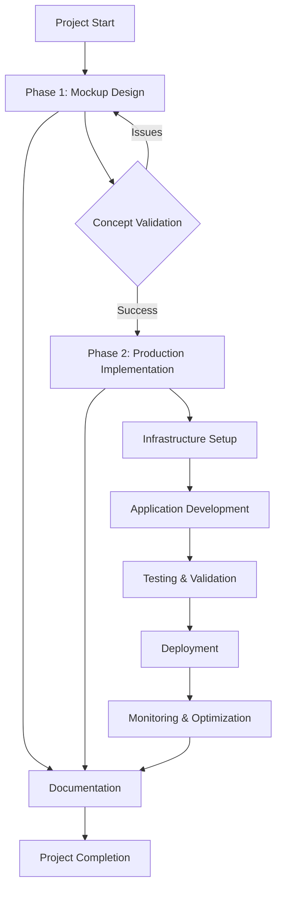
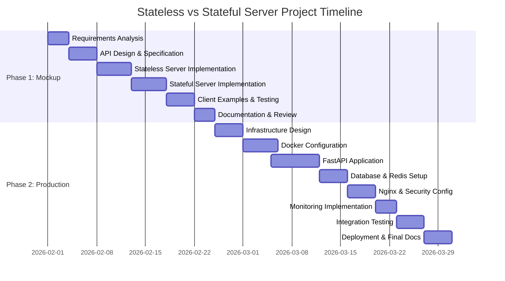

# Master Development Plan: Stateless vs Stateful Server Network Assignment

## Executive Summary

This master development plan synthesizes **Phase 1 (Mockup)** and **Phase 2 (Production Implementation)** into a cohesive implementation strategy for the stateless vs stateful server network assignment. The plan provides a unified roadmap that ensures smooth transition from concept validation to production deployment while maintaining educational objectives and technical rigor.

### Project Vision
Create a comprehensive demonstration system that:
1. **Educates** on stateless vs stateful server architectures through practical examples
2. **Validates** architectural concepts through iterative development
3. **Implements** production-ready infrastructure with modern DevOps practices
4. **Documents** the entire process for educational and reference purposes

---

## 1. Integrated Project Overview

### 1.1 Project Objectives

| Objective | Phase 1 Focus | Phase 2 Focus | Success Criteria |
|-----------|---------------|---------------|------------------|
| **Concept Demonstration** | Clear stateless vs stateful examples | Production-grade implementation | Users can clearly differentiate architectures |
| **Technical Validation** | Proof-of-concept functionality | Scalable, secure, monitored system | All components work together seamlessly |
| **Educational Value** | Easy-to-run examples | Real-world deployment experience | Comprehensive documentation and examples |
| **Transition Path** | Mockup design | Production migration | Smooth upgrade path with minimal rework |

### 1.2 Core Architecture Principles

1. **Separation of Concerns**: Clear distinction between stateless and stateful components
2. **Progressive Enhancement**: Phase 1 provides foundation for Phase 2
3. **Infrastructure as Code**: All deployment configurations version-controlled
4. **Observability First**: Built-in monitoring from the start
5. **Security by Design**: Authentication, encryption, and access controls

### 1.3 High-Level Architecture Flow



---

## 2. Phased Implementation Strategy

### 2.1 Phase 1: Mockup Implementation (Node.js/Express)

**Primary Goal**: Validate architectural concepts and create educational examples

#### 2.1.1 Key Deliverables
- [ ] **Mock Server Implementation**: Stateless and stateful Node.js/Express servers
- [ ] **API Specification**: Complete endpoint documentation
- [ ] **Client Examples**: Demonstration clients for both architectures
- [ ] **Testing Suite**: Unit and integration tests
- [ ] **Documentation**: Concepts, setup guide, and transition notes

#### 2.1.2 Technical Stack
- **Runtime**: Node.js 18+
- **Framework**: Express.js
- **Storage**: In-memory objects, JSON files
- **Testing**: Jest, Supertest
- **Documentation**: OpenAPI/Swagger

#### 2.1.3 Dependencies on Phase 2
- API design should align with Phase 2 endpoints
- Data models should be compatible with PostgreSQL schema
- Session management patterns should map to Redis implementation

### 2.2 Phase 2: Production Implementation (Python/FastAPI + Docker)

**Primary Goal**: Create production-ready system with full infrastructure

#### 2.2.1 Key Deliverables
- [ ] **Containerized Application**: Docker images for all components
- [ ] **Database Schema**: PostgreSQL with migrations
- [ ] **Session Management**: Redis integration
- [ ] **Reverse Proxy**: Nginx configuration with SSL
- [ ] **Monitoring Stack**: Prometheus + Grafana
- [ ] **Deployment Scripts**: Docker Compose, Ubuntu setup
- [ ] **Security Configuration**: Authentication, rate limiting, encryption

#### 2.2.2 Technical Stack
- **Application**: Python 3.11, FastAPI
- **Database**: PostgreSQL 15
- **Cache/Sessions**: Redis 7
- **Web Server**: Nginx 1.24
- **Containerization**: Docker, Docker Compose
- **Monitoring**: Prometheus, Grafana, Loki
- **Security**: Let's Encrypt, JWT, rate limiting

#### 2.2.3 Dependencies on Phase 1
- API endpoints should maintain backward compatibility where possible
- Client examples should work with minimal modifications
- Educational concepts should be preserved and enhanced

### 2.3 Phase Transition Strategy

#### 2.3.1 Parallel Development Approach
```
Week 1-2: Phase 1 Core Implementation
Week 3:   Phase 1 Testing & Documentation
Week 4:   Phase 2 Infrastructure Setup
Week 5-6: Phase 2 Application Development  
Week 7:   Integration & Migration Testing
Week 8:   Deployment & Final Documentation
```

#### 2.3.2 Migration Path
1. **API Compatibility Layer**: Ensure Phase 2 supports Phase 1 endpoints
2. **Data Migration**: Scripts to move from JSON files to PostgreSQL
3. **Session Migration**: Map in-memory sessions to Redis
4. **Client Updates**: Minimal changes to demonstration clients

---

## 3. Timeline and Milestones

### 3.1 Overall Project Timeline (8 Weeks)



### 3.2 Critical Milestones

#### Milestone 1: Phase 1 Completion (Week 3)
- ✅ Functional mockup servers (stateless and stateful)
- ✅ Complete API documentation
- ✅ Working client examples
- ✅ Basic test suite passing

#### Milestone 2: Infrastructure Ready (Week 5)
- ✅ Docker Compose environment running locally
- ✅ PostgreSQL and Redis containers operational
- ✅ Nginx reverse proxy configured
- ✅ Basic monitoring setup

#### Milestone 3: Application Complete (Week 7)
- ✅ FastAPI application with all endpoints
- ✅ Database migrations and seed data
- ✅ Session management with Redis
- ✅ Authentication and security features

#### Milestone 4: Production Deployment (Week 8)
- ✅ Ubuntu server deployment
- ✅ SSL certificates configured
- ✅ Monitoring dashboards operational
- ✅ Performance testing completed
- ✅ Final documentation delivered

---

## 4. Resource Requirements

### 4.1 Development Environment

#### Hardware Requirements
- **Development Machine**: 8GB RAM, 4-core CPU, 20GB free disk space
- **Test Server** (optional): Ubuntu 22.04 VM with 4GB RAM, 2 vCPUs
- **Network**: Reliable internet connection for package downloads

#### Software Requirements
- **Phase 1**: Node.js 18+, npm/yarn, Git, VS Code/IDE
- **Phase 2**: Python 3.11+, Docker Desktop, Docker Compose, PostgreSQL client, Redis CLI
- **Optional**: VirtualBox/VMware for Ubuntu testing

### 4.2 Skill Requirements

#### Core Development Skills
- **JavaScript/Node.js**: Intermediate (Phase 1)
- **Python/FastAPI**: Intermediate (Phase 2)
- **SQL/PostgreSQL**: Basic to Intermediate
- **Redis**: Basic understanding
- **Docker**: Basic containerization concepts

#### Infrastructure Skills
- **Nginx Configuration**: Basic reverse proxy setup
- **Linux/Ubuntu**: Basic command line proficiency
- **Networking**: HTTP/HTTPS, ports, DNS basics
- **Security**: SSL/TLS, authentication concepts

#### DevOps Skills
- **Docker Compose**: Multi-container orchestration
- **Monitoring**: Basic Prometheus/Grafana setup
- **CI/CD**: Basic understanding (optional)

### 4.3 Time Allocation

| Task Category | Estimated Hours | Phase |
|---------------|----------------|-------|
| **Phase 1 Development** | 40-50 hours | 1 |
| **Phase 2 Application** | 60-70 hours | 2 |
| **Infrastructure Setup** | 20-30 hours | 2 |
| **Testing & Validation** | 15-20 hours | Both |
| **Documentation** | 20-25 hours | Both |
| **Deployment & Troubleshooting** | 15-20 hours | 2 |
| **Total** | **170-215 hours** | |

---

## 5. Risk Assessment and Mitigation

### 5.1 Technical Risks

| Risk | Probability | Impact | Mitigation Strategy |
|------|-------------|--------|---------------------|
| **API Incompatibility** between phases | Medium | High | Design API contracts early, maintain backward compatibility |
| **Docker Networking Issues** | Medium | Medium | Use Docker Compose networking, test locally first |
| **Database Migration Problems** | Low | High | Create comprehensive migration scripts, backup strategy |
| **Performance Bottlenecks** | Low | Medium | Load testing early, monitoring in place |
| **Security Vulnerabilities** | Medium | High | Follow security best practices, regular updates |

### 5.2 Project Risks

| Risk | Probability | Impact | Mitigation Strategy |
|------|-------------|--------|---------------------|
| **Scope Creep** | High | Medium | Clear requirements, phased delivery, regular reviews |
| **Skill Gaps** | Medium | Medium | Focused learning, reference documentation, peer support |
| **Time Constraints** | High | High | Realistic timeline, prioritize core features, iterative approach |
| **Technology Changes** | Low | Low | Use stable versions, avoid cutting-edge dependencies |
| **Documentation Debt** | High | Medium | Document as you go, include in definition of done |

### 5.3 Mitigation Implementation

1. **Weekly Checkpoints**: Review progress against milestones
2. **Backup Strategy**: Regular commits, database backups, configuration versioning
3. **Fallback Options**: Ability to revert to previous working state
4. **Knowledge Sharing**: Document decisions and lessons learned
5. **Testing Strategy**: Comprehensive test coverage at each phase

---

## 6. Testing and Validation Strategy

### 6.1 Phase 1 Testing Approach

#### Unit Testing
- **Stateless Server**: Test each endpoint independently
- **Stateful Server**: Test session management and state persistence
- **Mock Data**: Test data generation and validation

#### Integration Testing
- **Client-Server Interaction**: Verify end-to-end functionality
- **API Contract Testing**: Ensure endpoints match specification
- **Error Handling**: Test error conditions and responses

#### Validation Criteria
- All endpoints respond correctly
- Stateless behavior demonstrated (no session persistence)
- Stateful behavior demonstrated (session tracking works)
- Client examples function as expected

### 6.2 Phase 2 Testing Approach

#### Component Testing
- **FastAPI Endpoints**: Unit tests for each route
- **Database Layer**: Test models, queries, and migrations
- **Redis Integration**: Test session storage and retrieval
- **Nginx Configuration**: Test routing and SSL termination

#### Integration Testing
- **Container Integration**: Test Docker Compose setup
- **Service Communication**: Verify inter-container networking
- **Authentication Flow**: Test login, session, and authorization

#### Performance Testing
- **Load Testing**: Simulate multiple concurrent users
- **Session Management**: Test Redis performance under load
- **Database Queries**: Monitor query performance and optimization

#### Security Testing
- **Authentication**: Test JWT validation and expiration
- **Authorization**: Test role-based access controls
- **Input Validation**: Test for injection vulnerabilities
- **SSL/TLS**: Verify certificate configuration

### 6.3 Cross-Phase Validation

#### API Compatibility Testing
- Compare Phase 1 and Phase 2 endpoint responses
- Ensure data formats are compatible
- Verify error handling consistency

#### Migration Testing
- Test data migration from JSON files to PostgreSQL
- Verify session migration from in-memory to Redis
- Ensure client compatibility with minimal changes

#### Educational Value Validation
- Verify concepts are clearly demonstrated
- Test example scenarios and documentation
- Gather feedback on learning effectiveness

---

## 7. Deployment and Transition Checklist

### 7.1 Phase 1 to Phase 2 Transition

#### Pre-Transition Preparation
- [ ] **API Documentation Review**: Ensure Phase 2 matches Phase 1 API spec
- [ ] **Data Backup**: Export all mock data from Phase 1
- [ ] **Client Compatibility**: Identify required client changes
- [ ] **Testing Environment**: Set up parallel testing environment

#### Migration Execution
- [ ] **Database Setup**: Initialize PostgreSQL with schema
- [ ] **Data Migration**: Import mock data into PostgreSQL
- [ ] **Session Migration**: Map session data to Redis
- [ ] **Application Deployment**: Deploy FastAPI application
- [ ] **Proxy Configuration**: Set up Nginx routing

#### Post-Migration Validation
- [ ] **Functional Testing**: Verify all endpoints work
- [ ] **Data Integrity**: Verify migrated data accuracy
- [ ] **Performance Baseline**: Establish performance metrics
- [ ] **Client Testing**: Verify client applications work

### 7.2 Production Deployment Checklist

#### Infrastructure Readiness
- [ ] **Ubuntu Server**: Updated and secured
- [ ] **Docker Installation**: Latest version installed
- [ ] **Network Configuration**: Ports open, firewall configured
- [ ] **Domain/DNS**: Configured and pointing to server

#### Application Deployment
- [ ] **Docker Images**: Built and tagged
- [ ] **Environment Variables**: Configured for production
- [ ] **Database Initialization**: Migrations applied, seed data loaded
- [ ] **Redis Configuration**: Persistence enabled, password set

#### Security Configuration
- [ ] **SSL Certificates**: Let's Encrypt certificates installed
- [ ] **Firewall Rules**: Only necessary ports open
- [ ] **Authentication**: JWT secrets configured, strong passwords
- [ ] **Rate Limiting**: Configured in Nginx and application

#### Monitoring Setup
- [ ] **Prometheus**: Configured to scrape all services
- [ ] **Grafana**: Dashboards imported and configured
- [ ] **Alerting**: Basic alert rules configured
- [ ] **Logging**: Centralized logging operational

#### Final Validation
- [ ] **Smoke Tests**: Basic functionality verification
- [ ] **Security Scan**: Basic vulnerability assessment
- [ ] **Performance Test**: Load testing with realistic traffic
- [ ] **Backup Test**: Verify backup and restore procedure

### 7.3 Rollback Plan

#### Conditions for Rollback
- Critical security vulnerability discovered
- Performance degradation beyond acceptable limits
- Data corruption or loss
- Service unavailable for extended period

#### Rollback Procedure
1. **Immediate Action**: Revert to previous Docker image tag
2. **Database Restoration**: Restore from latest backup
3. **Configuration Revert**: Roll back configuration changes
4. **Client Notification**: Inform users of temporary service interruption
5. **Root Cause Analysis**: Investigate and document issue

---

## 8. Success Criteria and Metrics

### 8.1 Phase 1 Success Criteria

#### Technical Success
- [ ] All API endpoints implemented and functional
- [ ] Stateless and stateful behaviors clearly demonstrated
- [ ] Test suite with >80% code coverage
- [ ] Documentation complete and accurate

#### Educational Success
- [ ] Concepts clearly explained in documentation
- [ ] Example scenarios work as described
- [ ] Easy setup process (under 15 minutes)
- [ ] Clear differentiation between architectures

### 8.2 Phase 2 Success Criteria

#### Technical Success
- [ ] All containers start without errors
- [ ] Application responds within <200ms for 95% of requests
- [ ] Database queries optimized and indexed
- [ ] SSL/TLS encryption properly configured
- [ ] Monitoring dashboards show all metrics

#### Operational Success
- [ ] Deployment process documented and repeatable
- [ ] Backup and restore procedure tested
- [ ] Security audit passes basic checks
- [ ] System handles expected load without degradation

### 8.3 Overall Project Success Metrics

| Metric | Target | Measurement Method |
|--------|--------|-------------------|
| **System Availability** | >99% uptime | Monitoring alerts, uptime tracking |
| **Response Time** | <200ms p95 | Application metrics, load testing |
| **Error Rate** | <1% of requests | Application logs, error tracking |
| **Test Coverage** | >80% | Code coverage tools |
| **Documentation Completeness** | 100% of features | Review against requirements |
| **Educational Effectiveness** | Clear understanding | User feedback, example success |

---

## 9. Documentation Strategy

### 9.1 Documentation Hierarchy

```
project-docs/
├── README.md                          # Project overview
├── SETUP.md                           # Development environment setup
├── ARCHITECTURE.md                    # System architecture
├── API-REFERENCE.md                   # Complete API documentation
│
├── phase1/                            # Phase 1 specific docs
│   ├── CONCEPTS.md                    # Stateless vs stateful concepts
│   ├── MOCKUP-GUIDE.md                # Running the mockup
│   └── TRANSITION-PLAN.md             # Moving to Phase 2
│
├── phase2/                            # Phase 2 specific docs
│   ├── DEPLOYMENT.md                  # Production deployment guide
│   ├── DOCKER-GUIDE.md                # Container management
│   ├── MONITORING.md                  # Monitoring setup and use
│   └── TROUBLESHOOTING.md            # Common issues and solutions
│
└── developer/                         # Developer documentation
    ├── DEVELOPMENT-GUIDE.md           # Contributing guidelines
    ├── TESTING.md                     # Testing strategy and execution
    └── SECURITY.md                    # Security considerations
```

### 9.2 Documentation Standards

1. **Code Documentation**: All functions and classes documented
2. **API Documentation**: OpenAPI/Swagger specification
3. **Configuration Documentation**: All config files explained
4. **Deployment Documentation**: Step-by-step procedures
5. **Troubleshooting Documentation**: Common issues and solutions

### 9.3 Documentation Maintenance

- **As-You-Go Approach**: Document features as they're implemented
- **Review Process**: Documentation reviewed with code changes
- **Version Alignment**: Documentation versioned with code releases
- **Feedback Incorporation**: Update based on user questions and issues

---

## 10. Conclusion and Next Steps

### 10.1 Immediate Next Steps

1. **Review and Finalize** this master development plan
2. **Begin Phase 1 Implementation** following the detailed mockup design
3. **Set up Project Tracking** using the provided milestones
4. **Establish Communication Channels** for team collaboration (if applicable)

### 10.2 Long-Term Considerations

#### Scalability Options
- **Horizontal Scaling**: Add more application instances behind load balancer
- **Database Scaling**: Read replicas, connection pooling
- **Cache Optimization**: Redis cluster for larger deployments
- **CDN Integration**: For static assets in production

#### Future Enhancements
- **Additional Authentication Methods**: OAuth, social login
- **Advanced Monitoring**: Distributed tracing, anomaly detection
- **CI/CD Pipeline**: Automated testing and deployment
- **Multi-region Deployment**: Geographic redundancy

### 10.3 Final Recommendations

1. **Follow the Phased Approach**: Don't skip Phase 1 validation
2. **Invest in Documentation**: Saves time in the long run
3. **Monitor Early and Often**: Establish baselines during development
4. **Security First**: Implement security controls from the beginning
5. **Test Thoroughly**: Comprehensive testing prevents production issues

---

## Appendices

### A. References to Existing Documents

1. **Phase 1 Mockup Design**: `week02-stateless-stateful/phase1_mockup_design.md`
2. **Phase 2 Implementation Plan**: `week02-stateless-stateful/phase2_implementation_plan.md`
3. **API Specification**: `week02-stateless-stateful/mockup_api_specification.md`
4. **Testing Strategy**: `week02-stateless-stateful/mockup_testing_strategy.md`
5. **Transition Plan**: `week02-stateless-stateful/phase2_transition_plan.md`

### B. Glossary of Terms

- **Stateless Server**: Server that doesn't retain client state between requests
- **Stateful Server**: Server that maintains client state across multiple requests
- **Session**: Temporary interactive information exchange between client and server
- **Reverse Proxy**: Server that sits between clients and backend servers
- **Containerization**: Packaging application with dependencies into isolated units

### C. Tool and Technology References

- **Node.js/Express**: https://expressjs.com/
- **Python/FastAPI**: https://fastapi.tiangolo.com/
- **Docker**: https://www.docker.com/
- **PostgreSQL**: https://www.postgresql.org/
- **Redis**: https://redis.io/
- **Nginx**: https://nginx.org/
- **Prometheus**: https://prometheus.io/
- **Grafana**: https://grafana.com/

---

*This master development plan serves as the comprehensive roadmap for the stateless vs stateful server network assignment. It should be reviewed and updated as the project progresses to reflect actual implementation decisions and lessons learned.*

**Last Updated**: 2026-02-05  
**Version**: 1.0  
**Status**: Draft for Review