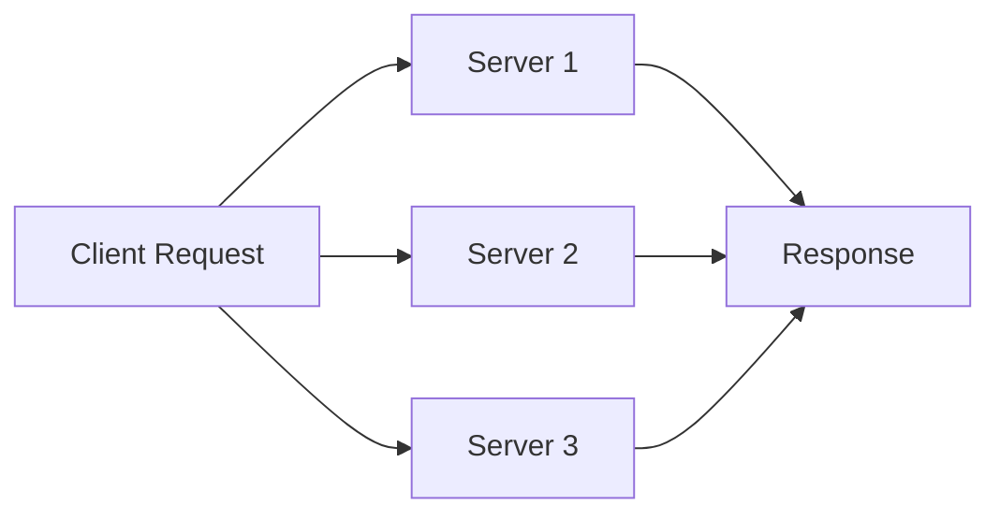
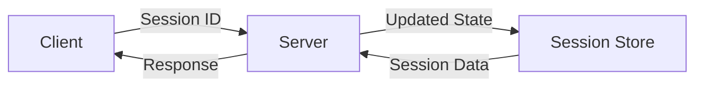
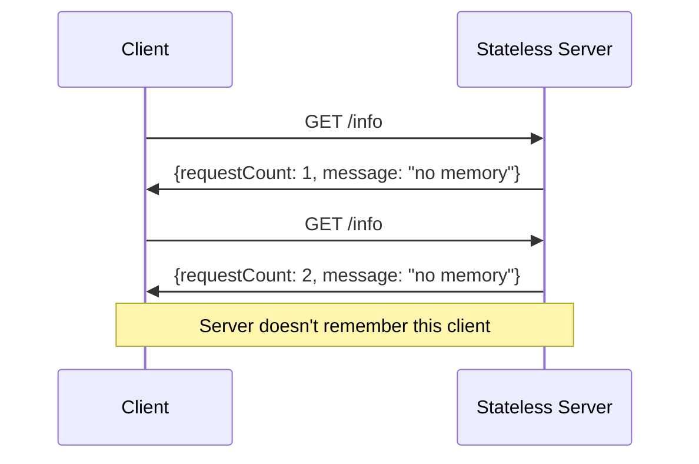
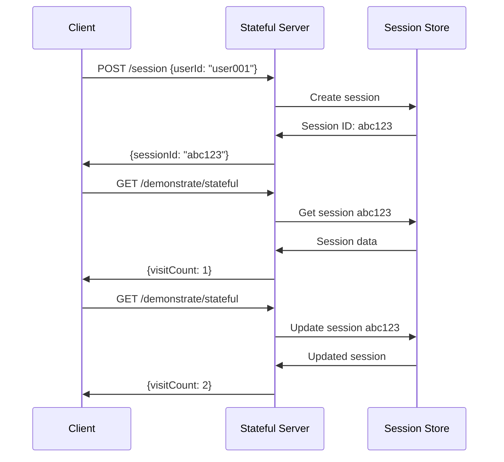
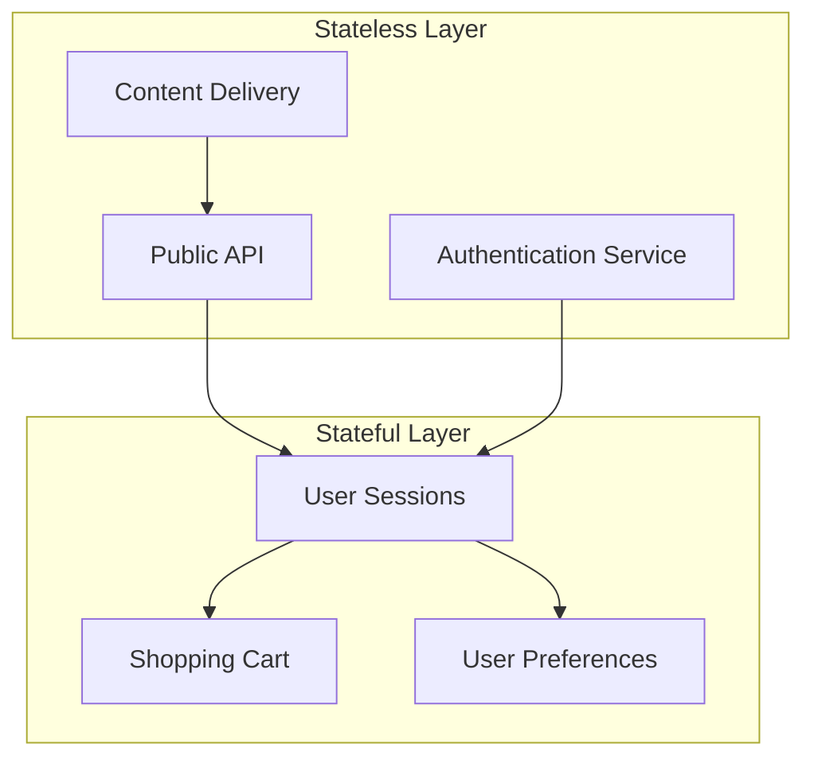

# Stateless vs Stateful Architecture Concepts

## Overview

This document explains the fundamental concepts behind stateless and stateful server architectures, using the Phase 1 mockup implementation as a practical example.

---

## Core Concepts

### What is "State"?

In web applications, **state** refers to any information that persists between requests:

- **Client State**: User authentication status, shopping cart contents, preferences
- **Session State**: Temporary data stored during a user's visit
- **Application State**: Server-wide information like counters, caches

### Stateless Architecture

#### Definition
A **stateless** server treats each request as an independent transaction. It does not maintain any information about previous requests from the same client.

#### Key Characteristics
- **No Memory**: Each request is processed in isolation
- **Self-Contained**: All necessary information is included in each request
- **Scalable**: Any server instance can handle any request
- **Simple**: Easier to debug and test

#### Real-World Examples
- **REST APIs**: Each API call contains all needed information
- **CDNs**: Content delivery without user context
- **Load Balancers**: Distribute requests without tracking users
- **DNS Servers**: Resolve names without remembering queries

#### Benefits


- **Horizontal Scaling**: Add more servers easily
- **Load Distribution**: Any server can handle any request
- **Fault Tolerance**: Server failures don't affect user sessions
- **Simplicity**: No session management complexity

#### Trade-offs
- **Limited Functionality**: Cannot maintain user context
- **Client Responsibility**: Client must manage state
- **Redundant Data**: Same information sent repeatedly
- **User Experience**: Less personalized interactions

### Stateful Architecture

#### Definition
A **stateful** server maintains information about clients across multiple requests, creating a continuous conversation.

#### Key Characteristics
- **Memory**: Server remembers previous interactions
- **Session Management**: Tracks user sessions over time
- **Context**: Maintains user-specific information
- **Rich Features**: Enables complex user experiences

#### Real-World Examples
- **Online Banking**: Account balances, transaction history
- **E-commerce**: Shopping carts, user preferences
- **Social Media**: Friend lists, notifications
- **Online Games**: Player progress, game state

#### Benefits


- **Rich Interactions**: Shopping carts, user preferences
- **Personalization**: Tailored user experiences
- **Efficiency**: Avoid sending redundant data
- **Complex Workflows**: Multi-step processes

#### Trade-offs
- **Scaling Complexity**: Requires session affinity or shared storage
- **Memory Usage**: Server resources for session storage
- **Failure Impact**: Server failures affect user sessions
- **Implementation Complexity**: Session management, cleanup

---

## Comparison Matrix

| Aspect | Stateless | Stateful |
|--------|-----------|----------|
| **Memory** | None between requests | Maintains client state |
| **Scalability** | Easy horizontal scaling | Requires session affinity |
| **Complexity** | Simple implementation | Complex session management |
| **User Experience** | Basic interactions | Rich, personalized |
| **Resource Usage** | Lower memory usage | Higher memory usage |
| **Fault Tolerance** | High | Lower |
| **Development** | Simpler debugging | More complex debugging |
| **Testing** | Easier unit testing | Requires session setup |

---

## Implementation in Phase 1 Mockup

### Stateless Server (Port 3001)

#### Architecture
```javascript
// Each request is independent
app.get('/info', (req, res) => {
    const requestCount = incrementGlobalCount();
    // No memory of previous requests from this client
    res.json({
        requestCount,
        message: "I have no memory of previous requests"
    });
});
```

#### Key Features
- **Request Counting**: Global counter, not per-client
- **Calculations**: One-time mathematical operations
- **Data Access**: Same data returned every time
- **No Sessions**: No authentication or user tracking

#### Example Flow


### Stateful Server (Port 3002)

#### Architecture
```javascript
// Session-based memory
app.get('/demonstrate/stateful', (req, res) => {
    const session = getSession(req.headers['session-id']);
    const visitCount = (session.visitCount || 0) + 1;
    session.visitCount = visitCount;
    
    res.json({
        visitCount,
        message: "I remember you! This is visit #" + visitCount
    });
});
```

#### Key Features
- **Session Management**: Session creation, tracking, cleanup
- **Shopping Cart**: Persistent cart across requests
- **User Profiles**: Stored preferences and settings
- **Multi-step Workflows**: Stateful process management

#### Example Flow


---

## When to Use Each Approach

### Use Stateless When:

#### Public APIs
```javascript
// API for external consumption
GET /api/v1/products
GET /api/v1/users/123
POST /api/v1/calculate
```
- Multiple consumers
- No user context needed
- Maximum scalability required
- Simple data operations

#### Content Delivery
```javascript
// Static or cacheable content
GET /images/banner.jpg
GET /css/styles.css
GET /js/app.js
```
- Cache-friendly
- High traffic volume
- No personalization needed
- CDN distribution

#### Microservices
```javascript
// Service-to-service communication
GET /service-a/data
POST /service-b/process
```
- Independent services
- Load balancing
- Fault isolation
- Simple contracts

### Use Stateful When:

#### User Applications
```javascript
// User-specific features
GET /profile
POST /cart/add
GET /preferences
```
- Personalized experience
- User authentication
- Session management
- Complex interactions

#### E-commerce
```javascript
// Shopping and purchasing
POST /cart/add
GET /cart
POST /checkout
```
- Shopping cart persistence
- User preferences
- Order tracking
- Payment processing

#### Collaborative Tools
```javascript
// Multi-user interactions
GET /documents/shared
POST /comments/add
GET /notifications
```
- Real-time updates
- User presence
- Shared state
- Activity tracking

---

## Hybrid Approaches

### Mixed Architecture
Many real-world applications use both approaches:



#### Implementation Strategies
1. **API Gateway**: Stateless frontend, stateful backend
2. **Microservices**: Stateless services, stateful user service
3. **Client-Side State**: Stateless server, stateful client
4. **Database-Backed**: Stateless app, persistent database

### JWT Tokens
Bridging stateless and stateful:

```javascript
// Stateless server with stateful-like behavior
const token = jwt.sign({ userId, preferences }, secret);
// Token contains state, server doesn't need to remember
```

- **Server**: Stateless validation
- **Token**: Contains user state
- **Client**: Presents token each request
- **Benefits**: Scalability with user context

---

## Performance Considerations

### Stateless Performance

#### Advantages
- **Cacheability**: Responses can be cached
- **Load Distribution**: Even load across servers
- **Resource Efficiency**: Lower memory usage
- **Startup Time**: Faster server initialization

#### Metrics
```javascript
// Performance characteristics
{
  "memoryPerRequest": "low",
  "responseTime": "consistent",
  "throughput": "high",
  "scalability": "linear"
}
```

### Stateful Performance

#### Advantages
- **Reduced Data Transfer**: Don't send redundant data
- **Faster Operations**: In-memory session access
- **Rich Features**: Complex operations possible
- **User Experience**: More responsive interactions

#### Challenges
- **Memory Usage**: Sessions consume server memory
- **Session Cleanup**: Required for resource management
- **Database Load**: Persistent session storage
- **Network Overhead**: Session store communication

---

## Security Considerations

### Stateless Security

#### Advantages
- **No Session Hijacking**: No sessions to hijack
- **Simpler Authentication**: Token-based auth
- **Reduced Attack Surface**: Less state to protect
- **Easier Auditing**: Each request is independent

#### Considerations
- **Token Security**: JWT tokens must be protected
- **Input Validation**: Every request needs validation
- **Rate Limiting**: Per-IP or per-token limits

### Stateful Security

#### Challenges
- **Session Hijacking**: Protect session IDs
- **Session Fixation**: Prevent session fixation attacks
- **CSRF Protection**: Cross-site request forgery
- **Session Storage**: Secure session data storage

#### Best Practices
```javascript
// Secure session management
const sessionConfig = {
  secret: process.env.SESSION_SECRET,
  resave: false,
  saveUninitialized: false,
  cookie: {
    secure: true,
    httpOnly: true,
    maxAge: 24 * 60 * 60 * 1000 // 24 hours
  }
};
```

---

## Testing Strategies

### Testing Stateless Applications

#### Unit Testing
```javascript
// Easy to test - no setup required
describe('GET /info', () => {
  it('should return server info', async () => {
    const response = await request(app).get('/info');
    expect(response.body.requestCount).toBeDefined();
  });
});
```

#### Integration Testing
- **Independent Requests**: Each test is isolated
- **Predictable Responses**: Same input = same output
- **No State Cleanup**: Simplifies test setup
- **Parallel Testing**: Tests can run concurrently

### Testing Stateful Applications

#### Unit Testing
```javascript
// Requires session setup
describe('GET /demonstrate/stateful', () => {
  let sessionId;
  
  beforeEach(async () => {
    const response = await createTestSession();
    sessionId = response.body.session.id;
  });
  
  it('should track visit count', async () => {
    const response = await request(app)
      .get('/demonstrate/stateful')
      .set('Session-ID', sessionId);
    expect(response.body.visitCount).toBe(1);
  });
});
```

#### Integration Testing
- **Session Management**: Test session lifecycle
- **State Transitions**: Verify state changes
- **Cleanup Required**: Remove test sessions
- **Sequential Testing**: Some tests must run in order

---

## Migration Strategies

### From Stateless to Stateful

#### Reasons
- **User Requirements**: Need for personalization
- **Feature Addition**: Shopping carts, user profiles
- **Business Logic**: Complex workflows needed

#### Approach
```javascript
// Gradual migration
1. Add session layer
2. Migrate endpoints gradually
3. Maintain backward compatibility
4. Deprecate stateless endpoints
```

### From Stateful to Stateless

#### Reasons
- **Scaling Needs**: Better horizontal scaling
- **Simplification**: Reduce complexity
- **Performance**: Improve cacheability

#### Approach
```javascript
// State to client migration
1. Move state to client (JWT, localStorage)
2. Implement token-based auth
3. Update client logic
4. Remove server-side sessions
```

---

## Best Practices

### Stateless Best Practices

1. **Design Principles**
   - Keep endpoints simple and focused
   - Include all necessary data in requests
   - Use standard HTTP methods correctly
   - Implement proper caching headers

2. **Error Handling**
   - Provide clear error messages
   - Use appropriate HTTP status codes
   - Include error details in responses
   - Log errors for debugging

3. **Security**
   - Validate all input data
   - Implement rate limiting
   - Use HTTPS for all requests
   - Protect sensitive data

### Stateful Best Practices

1. **Session Management**
   - Use secure session IDs
   - Implement session expiration
   - Clean up expired sessions
   - Store minimal session data

2. **State Design**
   - Keep session state minimal
   - Avoid storing large objects
   - Use database for persistent data
   - Implement state validation

3. **Scalability**
   - Use shared session store for multiple servers
   - Implement session affinity if needed
   - Monitor session store performance
   - Plan for session store failures

---

## Conclusion

Understanding the trade-offs between stateless and stateful architectures is crucial for designing scalable, maintainable web applications. The Phase 1 mockup provides hands-on experience with both approaches, helping developers make informed decisions about when to use each pattern.

### Key Takeaways

1. **Stateless** = Simple, scalable, limited functionality
2. **Stateful** = Complex, feature-rich, scaling challenges
3. **Hybrid** = Best of both worlds, increased complexity
4. **Context** = Choose based on requirements, not preferences

### Next Steps

1. **Experiment** with both servers in the mockup
2. **Analyze** performance characteristics
3. **Design** your own applications using these concepts
4. **Explore** advanced patterns like microservices and serverless

The concepts demonstrated here form the foundation for modern web architecture and are essential knowledge for any full-stack developer.
