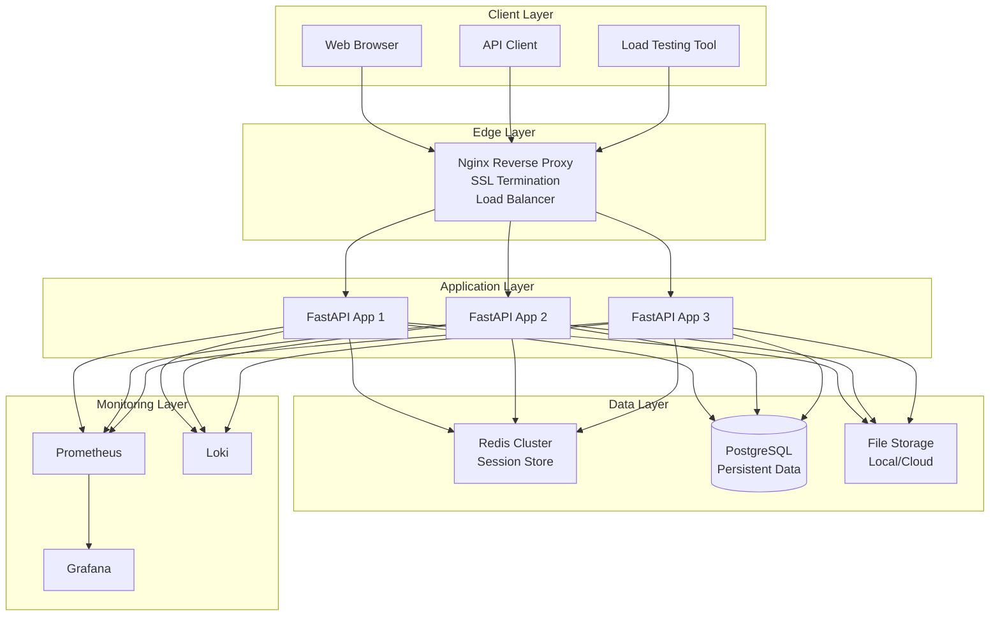
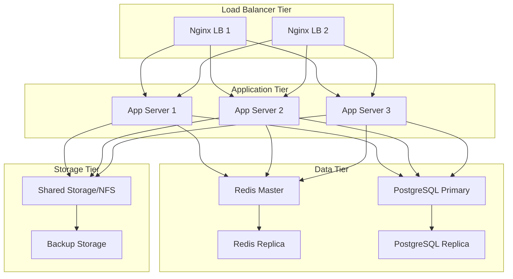
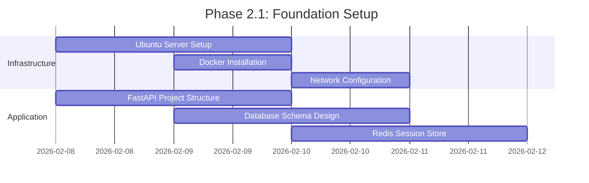
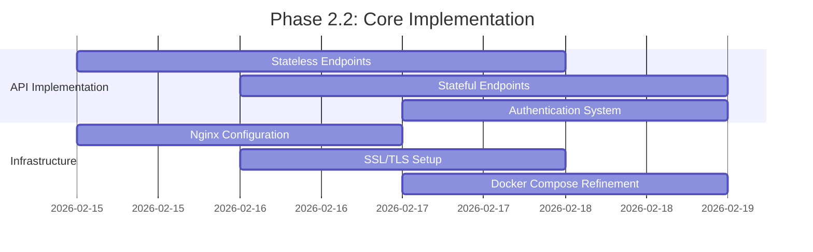
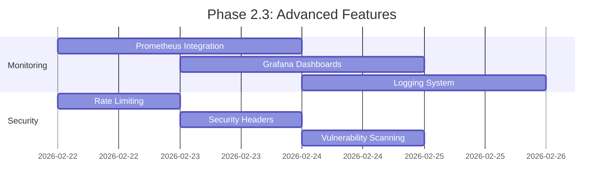
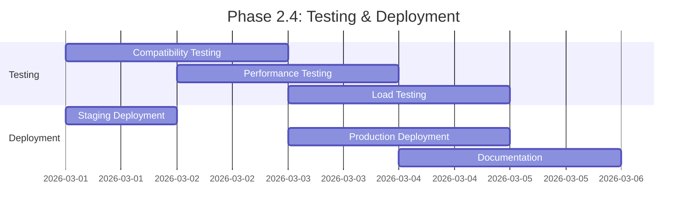

# Phase 2: Production Implementation Plan
## Real Server Implementation with Docker/Ubuntu/Nginx

### Executive Summary
Phase 2 transforms the Phase 1 Node.js/Express mockup into a production-ready system demonstrating stateless vs stateful server patterns with proper infrastructure, security, and scalability. This implementation will use Python FastAPI, Docker containerization, Ubuntu server, Nginx reverse proxy, Redis for session management, PostgreSQL for persistent data, and comprehensive monitoring.

---

## 1. Technology Stack Selection

### 1.1 Core Technology Decisions

| Component | Technology Choice | Rationale |
|-----------|-------------------|-----------|
| **Application Framework** | Python FastAPI | Consistent with Week 01 Python codebase, excellent async support, automatic OpenAPI documentation |
| **Session Storage** | Redis 7.x with persistence | High-performance in-memory store with disk persistence, ideal for session management |
| **Persistent Database** | PostgreSQL 15 | ACID compliance, robust for user data and file metadata, supports JSONB for flexible schema |
| **Web Server/Proxy** | Nginx 1.24 | Reverse proxy, load balancing, SSL termination, caching, and compression |
| **Containerization** | Docker + Docker Compose | Local development and single-server deployment |
| **Monitoring** | Prometheus + Grafana | Metrics collection and visualization |
| **Logging** | Structured JSON logging + Loki (optional) | Centralized log management |
| **Security** | Let's Encrypt (Certbot) | Automated SSL/TLS certificates |

### 1.2 Architecture Overview



### 1.3 Component Responsibilities

1. **FastAPI Application**: Implements both stateless and stateful endpoints, session management, authentication, and business logic
2. **Redis**: Stores active sessions, cache for frequently accessed data, pub/sub for real-time features
3. **PostgreSQL**: Persistent storage for users, file metadata, audit logs, and application data
4. **Nginx**: SSL termination, load balancing, static file serving, rate limiting, and security headers
5. **Prometheus**: Collects metrics from application, Redis, PostgreSQL, and system
6. **Grafana**: Visualizes metrics and provides dashboards for monitoring

---

## 2. Docker Architecture

### 2.1 Container Design

#### 2.1.1 Application Container (FastAPI)
```dockerfile
# Dockerfile.app
FROM python:3.11-slim

# Install system dependencies
RUN apt-get update && apt-get install -y \
    curl \
    gcc \
    && rm -rf /var/lib/apt/lists/*

WORKDIR /app

# Copy requirements first for better caching
COPY requirements.txt .
RUN pip install --no-cache-dir -r requirements.txt

# Copy application code
COPY . .

# Create non-root user
RUN useradd -m -u 1000 appuser && chown -R appuser:appuser /app
USER appuser

# Health check
HEALTHCHECK --interval=30s --timeout=3s --start-period=5s --retries=3 \
  CMD curl -f http://localhost:8000/health || exit 1

# Expose port
EXPOSE 8000

# Run application
CMD ["uvicorn", "main:app", "--host", "0.0.0.0", "--port", "8000", "--workers", "4"]
```

#### 2.1.2 Redis Container
```dockerfile
# Dockerfile.redis (or use official image)
FROM redis:7-alpine

# Enable persistence
RUN mkdir -p /data && chown redis:redis /data
VOLUME /data

# Custom configuration
COPY redis.conf /usr/local/etc/redis/redis.conf

# Health check
HEALTHCHECK --interval=30s --timeout=3s --start-period=5s --retries=3 \
  CMD redis-cli ping | grep -q PONG || exit 1

CMD ["redis-server", "/usr/local/etc/redis/redis.conf"]
```

#### 2.1.3 PostgreSQL Container
```dockerfile
# Dockerfile.db (or use official image)
FROM postgres:15-alpine

# Custom initialization
COPY init.sql /docker-entrypoint-initdb.d/

# Health check
HEALTHCHECK --interval=30s --timeout=3s --start-period=5s --retries=3 \
  CMD pg_isready -U appuser -d appdb || exit 1
```

### 2.2 Docker Compose Setup

```yaml
# docker-compose.yml
version: '3.8'

services:
  # FastAPI Application
  app:
    build:
      context: .
      dockerfile: Dockerfile.app
    ports:
      - "8000:8000"
    environment:
      - DATABASE_URL=postgresql://appuser:apppass@db:5432/appdb
      - REDIS_URL=redis://redis:6379/0
      - SECRET_KEY=${SECRET_KEY}
      - ENVIRONMENT=development
    depends_on:
      - db
      - redis
    volumes:
      - ./app:/app
      - ./logs:/app/logs
    networks:
      - app-network
    restart: unless-stopped

  # PostgreSQL Database
  db:
    image: postgres:15-alpine
    environment:
      POSTGRES_DB: appdb
      POSTGRES_USER: appuser
      POSTGRES_PASSWORD: apppass
    volumes:
      - postgres-data:/var/lib/postgresql/data
      - ./db/init.sql:/docker-entrypoint-initdb.d/init.sql
    ports:
      - "5432:5432"
    networks:
      - app-network
    restart: unless-stopped
    healthcheck:
      test: ["CMD-SHELL", "pg_isready -U appuser -d appdb"]
      interval: 30s
      timeout: 10s
      retries: 3

  # Redis for Sessions
  redis:
    image: redis:7-alpine
    command: redis-server --appendonly yes --requirepass ${REDIS_PASSWORD}
    volumes:
      - redis-data:/data
      - ./redis/redis.conf:/usr/local/etc/redis/redis.conf
    ports:
      - "6379:6379"
    networks:
      - app-network
    restart: unless-stopped
    healthcheck:
      test: ["CMD", "redis-cli", "--raw", "incr", "ping"]
      interval: 30s
      timeout: 10s
      retries: 3

  # Nginx Reverse Proxy
  nginx:
    image: nginx:alpine
    ports:
      - "80:80"
      - "443:443"
    volumes:
      - ./nginx/nginx.conf:/etc/nginx/nginx.conf
      - ./nginx/ssl:/etc/nginx/ssl
      - ./nginx/logs:/var/log/nginx
    depends_on:
      - app
    networks:
      - app-network
    restart: unless-stopped

  # Prometheus Monitoring
  prometheus:
    image: prom/prometheus:latest
    ports:
      - "9090:9090"
    volumes:
      - ./prometheus/prometheus.yml:/etc/prometheus/prometheus.yml
      - prometheus-data:/prometheus
    command:
      - '--config.file=/etc/prometheus/prometheus.yml'
      - '--storage.tsdb.path=/prometheus'
    networks:
      - app-network
    restart: unless-stopped

  # Grafana Dashboard
  grafana:
    image: grafana/grafana:latest
    ports:
      - "3000:3000"
    environment:
      - GF_SECURITY_ADMIN_PASSWORD=${GRAFANA_PASSWORD}
    volumes:
      - grafana-data:/var/lib/grafana
      - ./grafana/dashboards:/etc/grafana/provisioning/dashboards
      - ./grafana/datasources:/etc/grafana/provisioning/datasources
    depends_on:
      - prometheus
    networks:
      - app-network
    restart: unless-stopped

networks:
  app-network:
    driver: bridge

volumes:
  postgres-data:
  redis-data:
  prometheus-data:
  grafana-data:
```

### 2.3 Multi-Container Orchestration

#### 2.3.1 Service Discovery
- **Internal DNS**: Docker Compose provides service name resolution (e.g., `app`, `db`, `redis`)
- **Environment Variables**: Configuration passed via environment variables
- **Health Checks**: Each service has health checks for orchestration

#### 2.3.2 Configuration Management
```bash
# .env file
SECRET_KEY=your-secret-key-here
REDIS_PASSWORD=redis-password-here
DATABASE_URL=postgresql://appuser:apppass@db:5432/appdb
ENVIRONMENT=production
GRAFANA_PASSWORD=admin123
```

#### 2.3.3 Volume Management
- **PostgreSQL Data**: Persistent volume for database
- **Redis Data**: Append-only file (AOF) persistence
- **Application Logs**: Mounted host directory for log collection
- **SSL Certificates**: Mounted directory for Nginx SSL certificates

---

## 3. Ubuntu Server Setup

### 3.1 System Requirements

#### 3.1.1 Minimum Specifications
- **OS**: Ubuntu 22.04 LTS
- **CPU**: 2+ cores
- **RAM**: 4GB minimum, 8GB recommended
- **Storage**: 20GB SSD (plus additional for data)
- **Network**: Public IP with ports 80/443 open

#### 3.1.2 Recommended Cloud Configuration
```bash
# AWS EC2: t3.medium (2 vCPU, 4GB RAM)
# DigitalOcean: Standard Droplet (2 CPU, 4GB RAM)
# Azure: Standard_B2s (2 vCPU, 4GB RAM)
```

### 3.2 Initial Server Setup

#### 3.2.1 Basic Configuration
```bash
#!/bin/bash
# setup-server.sh

# Update system
sudo apt update && sudo apt upgrade -y

# Install essential packages
sudo apt install -y \
    curl \
    wget \
    git \
    vim \
    htop \
    net-tools \
    ufw \
    fail2ban \
    unattended-upgrades

# Configure firewall
sudo ufw allow OpenSSH
sudo ufw allow 80/tcp
sudo ufw allow 443/tcp
sudo ufw --force enable

# Configure automatic security updates
sudo dpkg-reconfigure --priority=low unattended-upgrades
```

#### 3.2.2 Docker Installation
```bash
#!/bin/bash
# install-docker.sh

# Remove old versions
sudo apt remove docker docker-engine docker.io containerd runc

# Install dependencies
sudo apt install -y \
    apt-transport-https \
    ca-certificates \
    curl \
    gnupg \
    lsb-release

# Add Docker GPG key
curl -fsSL https://download.docker.com/linux/ubuntu/gpg | sudo gpg --dearmor -o /usr/share/keyrings/docker-archive-keyring.gpg

# Add Docker repository
echo \
  "deb [arch=$(dpkg --print-architecture) signed-by=/usr/share/keyrings/docker-archive-keyring.gpg] https://download.docker.com/linux/ubuntu \
  $(lsb_release -cs) stable" | sudo tee /etc/apt/sources.list.d/docker.list > /dev/null

# Install Docker
sudo apt update
sudo apt install -y docker-ce docker-ce-cli containerd.io docker-compose-plugin

# Add user to docker group
sudo usermod -aG docker $USER

# Enable and start Docker
sudo systemctl enable docker
sudo systemctl start docker
```

### 3.3 Service Configuration

#### 3.3.1 Systemd Service for Application
```ini
# /etc/systemd/system/stateless-stateful.service
[Unit]
Description=Stateless vs Stateful Application
Requires=docker.service
After=docker.service

[Service]
Type=oneshot
RemainAfterExit=yes
WorkingDirectory=/opt/stateless-stateful
ExecStart=/usr/bin/docker-compose up -d
ExecStop=/usr/bin/docker-compose down
TimeoutStartSec=0

[Install]
WantedBy=multi-user.target
```

#### 3.3.2 Log Rotation Configuration
```bash
# /etc/logrotate.d/stateless-stateful
/opt/stateless-stateful/logs/*.log {
    daily
    rotate 30
    compress
    delaycompress
    missingok
    notifempty
    create 644 root root
    postrotate
        docker exec stateless-stateful_app_1 kill -USR1 1
    endscript
}
```

### 3.4 Security Hardening

#### 3.4.1 SSH Hardening
```bash
# /etc/ssh/sshd_config
Port 2222  # Change from default 22
PermitRootLogin no
PasswordAuthentication no
PubkeyAuthentication yes
AllowUsers deploy
MaxAuthTries 3
ClientAliveInterval 300
ClientAliveCountMax 2
```

#### 3.4.2 Fail2ban Configuration
```ini
# /etc/fail2ban/jail.local
[sshd]
enabled = true
port = 2222
filter = sshd
logpath = /var/log/auth.log
maxretry = 3
bantime = 3600

[nginx-http-auth]
enabled = true
filter = nginx-http-auth
port = http,https
logpath = /var/log/nginx/error.log
maxretry = 3
bantime = 3600
```

#### 3.4.3 Docker Security
```bash
# Create docker daemon configuration
sudo tee /etc/docker/daemon.json <<EOF
{
  "userns-remap": "default",
  "log-driver": "json-file",
  "log-opts": {
    "max-size": "10m",
    "max-file": "3"
  },
  "live-restore": true,
  "userland-proxy": false
}
EOF
```

### 3.5 Monitoring and Logging

#### 3.5.1 System Monitoring
```bash
# Install monitoring tools
sudo apt install -y \
    prometheus-node-exporter \
    nginx-prometheus-exporter

# Configure node exporter
sudo systemctl enable prometheus-node-exporter
sudo systemctl start prometheus-node-exporter
```

#### 3.5.2 Log Management
```bash
# Install Loki log collector
curl -fsSL https://raw.githubusercontent.com/grafana/loki/main/production/docker-compose.yaml -o docker-compose-loki.yaml

# Configure log shipping
docker run --name logspout \
    --volume=/var/run/docker.sock:/var/run/docker.sock \
    gliderlabs/logspout \
    syslog+tcp://loki:3100
```

---

## 4. Nginx Configuration

### 4.1 Reverse Proxy Setup

#### 4.1.1 Main Nginx Configuration
```nginx
# nginx/nginx.conf
user nginx;
worker_processes auto;
error_log /var/log/nginx/error.log warn;
pid /var/run/nginx.pid;

events {
    worker_connections 1024;
    use epoll;
    multi_accept on;
}

http {
    include /etc/nginx/mime.types;
    default_type application/octet-stream;

    # Logging
    log_format main '$remote_addr - $remote_user [$time_local] "$request" '
                    '$status $body_bytes_sent "$http_referer" '
                    '"$http_user_agent" "$http_x_forwarded_for" '
                    'rt=$request_time uct="$upstream_connect_time" '
                    'uht="$upstream_header_time" urt="$upstream_response_time"';

    access_log /var/log/nginx/access.log main;

    # Basic settings
    sendfile on;
    tcp_nopush on;
    tcp_nodelay on;
    keepalive_timeout 65;
    types_hash_max_size 2048;
    server_tokens off;

    # Gzip compression
    gzip on;
    gzip_vary on;
    gzip_min_length 1024;
    gzip_proxied any;
    gzip_comp_level 6;
    gzip_types
        text/plain
        text/css
        text/xml
        text/javascript
        application/json
        application/javascript
        application/xml+rss
        application/atom+xml
        image/svg+xml;

    # Rate limiting
    limit_req_zone $binary_remote_addr zone=api:10m rate=10r/s;
    limit_req_zone $binary_remote_addr zone=auth:10m rate=5r/m;

    # Upstream configuration
    upstream app_servers {
        least_conn;
        server app1:8000 max_fails=3 fail_timeout=30s;
        server app2:8000 max_fails=3 fail_timeout=30s;
        server app3:8000 max_fails=3 fail_timeout=30s;
        keepalive 32;
    }

    # Include server configurations
    include /etc/nginx/conf.d/*.conf;
}
```

#### 4.1.2 Application Server Configuration
```nginx
# nginx/conf.d/app.conf
server {
    listen 80;
    server_name stateless-stateful.example.com;
    return 301 https://$server_name$request_uri;
}

server {
    listen 443 ssl http2;
    server_name stateless-stateful.example.com;

    # SSL Configuration
    ssl_certificate /etc/nginx/ssl/fullchain.pem;
    ssl_certificate_key /etc/nginx/ssl/privkey.pem;
    ssl_protocols TLSv1.2 TLSv1.3;
    ssl_ciphers ECDHE-RSA-AES256-GCM-SHA512:DHE-RSA-AES256-GCM-SHA512:ECDHE-RSA-AES256-GCM-SHA384:DHE-RSA-AES256-GCM-SHA384;
    ssl_prefer_server_ciphers off;
    ssl_session_cache shared:SSL:10m;
    ssl_session_timeout 10m;

    # Security headers
    add_header X-Frame-Options "SAMEORIGIN" always;
    add_header X-Content-Type-Options "nosniff" always;
    add_header X-XSS-Protection "1; mode=block" always;
    add_header Referrer-Policy "strict-origin-when-cross-origin" always;
    add_header Content-Security-Policy "default-src 'self' http: https: data: blob: 'unsafe-inline'" always;
    add_header Strict-Transport-Security "max-age=31536000; includeSubDomains" always;

    # Root location
    location / {
        limit_req zone=api burst=20 nodelay;
        
        proxy_pass http://app_servers;
        proxy_http_version 1.1;
        proxy_set_header Upgrade $http_upgrade;
        proxy_set_header Connection 'upgrade';
        proxy_set_header Host $host;
        proxy_set_header X-Real-IP $remote_addr;
        proxy_set_header X-Forwarded-For $proxy_add_x_forwarded_for;
        proxy_set_header X-Forwarded-Proto $scheme;
        proxy_cache_bypass $http_upgrade;
        
        # Timeouts
        proxy_connect_timeout 60s;
        proxy_send_timeout 60s;
        proxy_read_timeout 60s;
    }

    # Stateless API endpoints
    location /api/stateless/ {
        limit_req zone=api burst=30 nodelay;
        
        proxy_pass http://app_servers;
        proxy_set_header Host $host;
        proxy_set_header X-Real-IP $remote_addr;
        
        # No session affinity for stateless
        proxy_set_header X-Session-Affinity "none";
    }

    # Stateful API endpoints
    location /api/stateful/ {
        limit_req zone=api burst=10 nodelay;
        
        # Session affinity for stateful endpoints
        proxy_pass http://app_servers;
        proxy_set_header Host $host;
        proxy_set_header X-Real-IP $remote_addr;
        
        # Enable sticky sessions
        proxy_set_header X-Session-Affinity "required";
    }

    # Health check endpoint
    location /health {
        access_log off;
        proxy_pass http://app_servers;
        proxy_set_header Host $host;
    }

    # Metrics endpoint (Prometheus)
    location /metrics {
        proxy_pass http://app_servers;
        proxy_set_header Host $host;
        auth_basic "Prometheus Metrics";
        auth_basic_user_file /etc/nginx/.htpasswd;
    }

    # Static files
    location /static/ {
        alias /app/static/;
        expires 1y;
        add_header Cache-Control "public, immutable";
    }

    # Error pages
    error_page 404 /404.html;
    error_page 500 502 503 504 /50x.html;
    location = /50x.html {
        root /usr/share/nginx/html;
    }
}
```

### 4.2 Load Balancing Configuration

#### 4.2.1 Load Balancing Strategies
```nginx
# Different load balancing methods for different endpoints

# Stateless endpoints - round robin
upstream stateless_servers {
    zone stateless 64k;
    least_conn;
    server app1:8000;
    server app2:8000;
    server app3:8000;
}

# Stateful endpoints - ip_hash for session affinity
upstream stateful_servers {
    zone stateful 64k;
    ip_hash;
    server app1:8000;
    server app2:8000;
    server app3:8000;
}
```

#### 4.2.2 Health Checks
```nginx
# Active health checks
upstream app_servers {
    zone backend 64k;
    
    server app1:8000 max_fails=3 fail_timeout=30s;
    server app2:8000 max_fails=3 fail_timeout=30s;
    server app3:8000 max_fails=3 fail_timeout=30s;
    
    # Health check configuration
    health_check interval=5s fails=3 passes=2 uri=/health match=status_ok;
}

match status_ok {
    status 200;
    header Content-Type = text/plain;
    body ~ "healthy";
}
```

### 4.3 SSL/TLS Configuration

#### 4.3.1 Let's Encrypt Setup
```bash
#!/bin/bash
# setup-ssl.sh

# Install Certbot
sudo apt install -y certbot python3-certbot-nginx

# Obtain certificate
sudo certbot --nginx -d stateless-stateful.example.com

# Configure auto-renewal
sudo certbot renew --dry-run

# Create renewal hook for Docker
sudo tee /etc/letsencrypt/renewal-hooks/post/reload-nginx.sh <<'EOF'
#!/bin/bash
docker exec nginx nginx -s reload
EOF
sudo chmod +x /etc/letsencrypt/renewal-hooks/post/reload-nginx.sh
```

#### 4.3.2 SSL Optimization
```nginx
# SSL optimization settings
ssl_session_cache shared:SSL:50m;
ssl_session_timeout 1d;
ssl_session_tickets off;

# OCSP stapling
ssl_stapling on;
ssl_stapling_verify on;
resolver 8.8.8.8 8.8.4.4 valid=300s;
resolver_timeout 5s;

# DH parameters
ssl_dhparam /etc/nginx/ssl/dhparam.pem;
```

### 4.4 Caching and Compression

#### 4.4.1 Proxy Caching
```nginx
# Cache configuration
proxy_cache_path /var/cache/nginx levels=1:2 keys_zone=api_cache:10m
                 max_size=1g inactive=60m use_temp_path=off;

location /api/stateless/ {
    proxy_cache api_cache;
    proxy_cache_key "$scheme$request_method$host$request_uri";
    proxy_cache_valid 200 302 5m;
    proxy_cache_valid 404 1m;
    proxy_cache_use_stale error timeout updating http_500 http_502 http_503 http_504;
    add_header X-Cache-Status $upstream_cache_status;
}
```

#### 4.4.2 Compression
```nginx
# Brotli compression (if available)
brotli on;
brotli_comp_level 6;
brotli_types
    text/plain
    text/css
    text/xml
    text/javascript
    application/json
    application/javascript
    application/xml+rss
    application/atom+xml
    image/svg+xml;
```

---

## 5. Production Architecture

### 5.1 High Availability Design

#### 5.1.1 Multi-Server Deployment


#### 5.1.2 Failover Strategy
- **Load Balancers**: Active-passive with keepalived
- **Application Servers**: Stateless auto-scaling group
- **Redis**: Sentinel-based failover
- **PostgreSQL**: Streaming replication with automatic failover
- **Storage**: RAID configuration with regular backups

### 5.2 Scalability Considerations

#### 5.2.1 Horizontal Scaling
```yaml
# docker-compose.scale.yml
services:
  app:
    image: stateless-stateful-app:latest
    deploy:
      mode: replicated
      replicas: 3
      update_config:
        parallelism: 1
        delay: 10s
      restart_policy:
        condition: on-failure
        delay: 5s
        max_attempts: 3
        window: 120s
    networks:
      - app-network
```

#### 5.2.2 Database Scaling
1. **PostgreSQL**:
   - Read replicas for reporting
   - Connection pooling with PgBouncer
   - Table partitioning for large datasets
   - Index optimization

2. **Redis**:
   - Redis Cluster for sharding
   - Read replicas for high read throughput
   - Memory optimization strategies

### 5.3 Database Replication Strategy

#### 5.3.1 PostgreSQL Replication
```sql
-- Primary server configuration (postgresql.conf)
wal_level = replica
max_wal_senders = 10
wal_keep_size = 1GB
hot_standby = on

-- Replica server configuration
primary_conninfo = 'host=primary.example.com port=5432 user=replicator password=secret'
hot_standby = on
```

#### 5.3.2 Redis Replication
```redis
# Redis master configuration (redis.conf)
requirepass masterpassword
masterauth replicapassword
appendonly yes
appendfsync everysec

# Redis replica configuration
replicaof master.example.com 6379
masterauth masterpassword
requirepass replicapassword
```

### 5.4 Backup and Recovery Procedures

#### 5.4.1 Backup Strategy
```bash
#!/bin/bash
# backup.sh

# PostgreSQL backup
pg_dump -h localhost -U appuser -d appdb -Fc -f /backup/postgres/$(date +%Y%m%d).dump

# Redis backup
redis-cli -a $REDIS_PASSWORD --rdb /backup/redis/$(date +%Y%m%d).rdb

# Application data backup
tar -czf /backup/app/$(date +%Y%m%d).tar.gz /opt/stateless-stateful/data

# Upload to cloud storage
aws s3 cp /backup/postgres/$(date +%Y%m%d).dump s3://backup-bucket/postgres/
aws s3 cp /backup/redis/$(date +%Y%m%d).rdb s3://backup-bucket/redis/
aws s3 cp /backup/app/$(date +%Y%m%d).tar.gz s3://backup-bucket/app/

# Cleanup old backups
find /backup -type f -mtime +30 -delete
```

#### 5.4.2 Recovery Procedures
```bash
#!/bin/bash
# restore.sh

# Stop services
docker-compose down

# Restore PostgreSQL
pg_restore -h localhost -U appuser -d appdb --clean --if-exists /backup/postgres/latest.dump

# Restore Redis
cat /backup/redis/latest.rdb | redis-cli -a $REDIS_PASSWORD --pipe

# Restore application data
tar -xzf /backup/app/latest.tar.gz -C /

# Start services
docker-compose up -d
```

#### 5.4.3 Disaster Recovery Plan
1. **RPO (Recovery Point Objective)**: 1 hour
2. **RTO (Recovery Time Objective)**: 4 hours
3. **Backup Retention**: 30 days daily, 12 months monthly
4. **Testing Schedule**: Quarterly recovery drills

---

## 6. Migration Path from Phase 1

### 6.1 Code Migration Strategy

#### 6.1.1 API Contract Preservation
```python
# Phase 1 (Node.js/Express) to Phase 2 (Python/FastAPI) mapping

# Stateless endpoints
GET /api/stateless/info          → GET /api/v1/stateless/info
POST /api/stateless/calculate    → POST /api/v1/stateless/calculate
GET /api/stateless/random        → GET /api/v1/stateless/random

# Stateful endpoints  
POST /api/stateful/session       → POST /api/v1/stateful/sessions
GET /api/stateful/session/:id    → GET /api/v1/stateful/sessions/{session_id}
POST /api/stateful/conversation  → POST /api/v1/stateful/conversations
GET /api/stateful/history/:id    → GET /api/v1/stateful/sessions/{session_id}/history
DELETE /api/stateful/session/:id → DELETE /api/v1/stateful/sessions/{session_id}
```

#### 6.1.2 Session Management Migration
```python
# Phase 1: In-memory session store (Node.js)
class SessionStore {
  constructor() {
    this.sessions = new Map();
  }
}

# Phase 2: Redis-based session store (Python)
import redis
import json
from datetime import datetime, timedelta

class RedisSessionStore:
    def __init__(self, redis_client):
        self.redis = redis_client
        self.session_ttl = timedelta(minutes=30)
    
    async def create_session(self, client_data: dict) -> str:
        session_id = str(uuid.uuid4())
        session_data = {
            'id': session_id,
            'client_data': client_data,
            'created_at': datetime.utcnow().isoformat(),
            'last_activity': datetime.utcnow().isoformat(),
            'message_count': 0
        }
        
        await self.redis.setex(
            f"session:{session_id}",
            int(self.session_ttl.total_seconds()),
            json.dumps(session_data)
        )
        
        return session_id
```

### 6.2 Data Migration Plan

#### 6.2.1 Mock Data to Database Migration
```python
# migration_script.py
import asyncpg
import json
from pathlib import Path

async def migrate_mock_data():
    # Load Phase 1 mock data
    with open('phase1-mockup/data/mock-users.json') as f:
        mock_users = json.load(f)
    
    with open('phase1-mockup/data/mock-products.json') as f:
        mock_products = json.load(f)
    
    # Connect to PostgreSQL
    conn = await asyncpg.connect(DATABASE_URL)
    
    # Migrate users
    for user in mock_users:
        await conn.execute('''
            INSERT INTO users (id, name, role, created_at)
            VALUES ($1, $2, $3, NOW())
            ON CONFLICT (id) DO NOTHING
        ''', user['id'], user['name'], user['role'])
    
    # Migrate products
    for product in mock_products:
        await conn.execute('''
            INSERT INTO products (id, name, price, stock, created_at)
            VALUES ($1, $2, $3, $4, NOW())
            ON CONFLICT (id) DO NOTHING
        ''', product['id'], product['name'], product['price'], product['stock'])
    
    await conn.close()
```

#### 6.2.2 Session Data Migration
Since Phase 1 sessions are in-memory only, we cannot migrate active sessions. Strategy:
1. **Graceful shutdown** of Phase 1 with notification to clients
2. **Client reauthentication** required when connecting to Phase 2
3. **Session state reconstruction** from client-side data if available

### 6.3 Testing and Validation Approach

#### 6.3.1 Compatibility Testing
```python
# test_compatibility.py
import pytest
import requests

@pytest.mark.parametrize("endpoint,method,expected_status", [
    ("/api/stateless/info", "GET", 200),
    ("/api/stateless/calculate", "POST", 200),
    ("/api/stateful/session", "POST", 201),
])
def test_phase2_compatible_with_phase1(endpoint, method, expected_status):
    """Test that Phase 2 implements all Phase 1 endpoints"""
    url = f"http://phase2-server{endpoint}"
    
    if method == "GET":
        response = requests.get(url)
    elif method == "POST":
        response = requests.post(url, json={})
    
    assert response.status_code == expected_status
    assert "application/json" in response.headers.get("Content-Type", "")
```

#### 6.3.2 Performance Benchmarking
```python
# test_performance.py
import asyncio
import aiohttp
import time
from datetime import datetime

async def benchmark_endpoint(session, url, requests=100):
    """Benchmark an endpoint with multiple concurrent requests"""
    start_time = time.time()
    tasks = [session.get(url) for _ in range(requests)]
    responses = await asyncio.gather(*tasks, return_exceptions=True)
    end_time = time.time()
    
    successful = sum(1 for r in responses if isinstance(r, aiohttp.ClientResponse) and r.status == 200)
    return {
        'endpoint': url,
        'total_requests': requests,
        'successful': successful,
        'failed': requests - successful,
        'total_time': end_time - start_time,
        'requests_per_second': requests / (end_time - start_time),
        'timestamp': datetime.utcnow().isoformat()
    }

async def compare_stateless_vs_stateful():
    """Compare performance of stateless vs stateful endpoints"""
    async with aiohttp.ClientSession() as session:
        # Benchmark stateless endpoint
        stateless_result = await benchmark_endpoint(
            session,
            'http://localhost:8000/api/v1/stateless/info',
            requests=1000
        )
        
        # Benchmark stateful endpoint (with session creation)
        stateful_result = await benchmark_endpoint(
            session,
            'http://localhost:8000/api/v1/stateful/sessions',
            requests=100
        )
        
        return {
            'stateless': stateless_result,
            'stateful': stateful_result,
            'comparison': {
                'stateless_rps': stateless_result['requests_per_second'],
                'stateful_rps': stateful_result['requests_per_second'],
                'ratio': stateless_result['requests_per_second'] / stateful_result['requests_per_second']
            }
        }
```

#### 6.3.3 Rollback Procedures
```bash
#!/bin/bash
# rollback.sh

# Phase 2 to Phase 1 rollback procedure

echo "Starting rollback from Phase 2 to Phase 1..."

# 1. Stop Phase 2 services
docker-compose down

# 2. Start Phase 1 mockup
cd ../phase1-mockup
npm start &

# 3. Update DNS/load balancer to point to Phase 1
# (This would be cloud-specific, e.g., update Route53, load balancer target group)

# 4. Verify Phase 1 is operational
curl -f http://localhost:3000/api/stateless/info || {
    echo "Phase 1 not responding, aborting rollback"
    exit 1
}

echo "Rollback completed successfully. Phase 1 is now serving traffic."
```

### 6.4 Validation Checklist
- [ ] All Phase 1 endpoints implemented in Phase 2
- [ ] Session persistence working correctly (Redis)
- [ ] Database migrations completed successfully
- [ ] Performance meets or exceeds Phase 1 baseline
- [ ] SSL/TLS certificates properly configured
- [ ] Monitoring and logging operational
- [ ] Backup and recovery procedures tested
- [ ] Security audit completed
- [ ] Documentation updated

---

## 7. Implementation Timeline

### 7.1 Phased Rollout Plan

#### Phase 2.1: Foundation (Week 1)


#### Phase 2.2: Core Implementation (Week 2)


#### Phase 2.3: Advanced Features (Week 3)


#### Phase 2.4: Testing & Deployment (Week 4)


### 7.2 Key Milestones

| Milestone | Date | Deliverables | Success Criteria |
|-----------|------|--------------|------------------|
| **M1: Infrastructure Ready** | Day 5 | Ubuntu server, Docker, network | All services can be deployed via Docker Compose |
| **M2: Core API Complete** | Day 10 | All Phase 1 endpoints implemented | 100% API compatibility with Phase 1 |
| **M3: Session Management** | Day 15 | Redis session store, authentication | Sessions persist across server restarts |
| **M4: Production Readiness** | Day 20 | Nginx, SSL, monitoring, backups | Passes security audit, monitoring operational |
| **M5: Go-Live** | Day 25 | Production deployment, documentation | System handling production traffic, docs complete |

### 7.3 Resource Requirements

#### 7.3.1 Human Resources
- **Lead Developer**: 1 FTE (Full architecture and implementation)
- **DevOps Engineer**: 0.5 FTE (Infrastructure and deployment)
- **QA Engineer**: 0.5 FTE (Testing and validation)
- **Technical Writer**: 0.25 FTE (Documentation)

#### 7.3.2 Technical Resources
- **Development**: Local Docker environment, CI/CD pipeline
- **Staging**: Single Ubuntu server (4GB RAM, 2 CPU)
- **Production**: Ubuntu server (8GB RAM, 4 CPU) or cloud equivalent
- **Monitoring**: Prometheus, Grafana, alerting system
- **Backup**: Cloud storage (S3, Backblaze, etc.)

#### 7.3.3 Software Resources
- **Licenses**: All open-source (no cost)
- **Services**: Domain name, SSL certificates (Let's Encrypt free)
- **Tools**: GitHub/GitLab, Docker Hub, monitoring tools

### 7.4 Risk Mitigation Strategies

#### 7.4.1 Technical Risks
| Risk | Probability | Impact | Mitigation Strategy |
|------|------------|--------|---------------------|
| **Session data loss** | Medium | High | Redis persistence + PostgreSQL backup + regular testing |
| **Performance degradation** | High | Medium | Load testing before each release, performance monitoring |
| **Database bottlenecks** | Medium | High | Connection pooling, query optimization, read replicas |
| **SSL certificate issues** | Low | High | Automated renewal with monitoring, manual backup certificates |
| **Docker compatibility** | Medium | Medium | Multi-stage builds, version pinning, regular updates |

#### 7.4.2 Operational Risks
| Risk | Probability | Impact | Mitigation Strategy |
|------|------------|--------|---------------------|
| **Team skill gaps** | Medium | High | Pair programming, documentation, training sessions |
| **Timeline slippage** | High | Medium | Agile sprints, MVP approach, feature prioritization |
| **Production deployment issues** | Low | High | Canary deployment, comprehensive rollback plan |
| **Documentation incomplete** | Medium | Medium | Documentation as part of definition of done, peer reviews |

#### 7.4.3 Security Risks
| Risk | Probability | Impact | Mitigation Strategy |
|------|------------|--------|---------------------|
| **Session hijacking** | Medium | High | Secure session IDs, HTTPS only, short TTLs |
| **DDoS attacks** | Low | High | Rate limiting, WAF, cloud DDoS protection |
| **Data breaches** | Low | High | Encryption at rest and in transit, access controls, auditing |
| **Vulnerability in dependencies** | High | Medium | Regular dependency updates, vulnerability scanning |

---

## 8. Success Metrics and KPIs

### 8.1 Technical Performance Metrics
- **Availability**: 99.9% uptime (≤ 8.76 hours downtime per year)
- **Response Time**: < 200ms for stateless, < 500ms for stateful endpoints
- **Throughput**: 1000+ requests/second for stateless, 100+ for stateful
- **Error Rate**: < 1% error rate under normal load
- **Session Persistence**: 100% session persistence across server restarts

### 8.2 Business Metrics
- **Deployment Success**: 100% of deployments without rollback
- **Cost Efficiency**: Infrastructure costs within 20% of budget
- **Team Velocity**: 80% of planned features delivered on schedule
- **Documentation Coverage**: 100% of APIs documented

### 8.3 Educational Metrics
- **Concept Clarity**: Clear demonstration of stateless vs stateful differences
- **Learning Value**: System serves as reference implementation for students
- **Extensibility**: Architecture allows for future enhancements
- **Code Quality**: High test coverage (>85%), PEP 8 compliance, good documentation

### 8.4 Monitoring Dashboard
Key metrics to monitor on Grafana dashboard:
1. **System Health**: CPU, memory, disk usage, network I/O
2. **Application Metrics**: Request rate, error rate, response time
3. **Database Metrics**: Connection count, query performance, replication lag
4. **Redis Metrics**: Memory usage, hit rate, connected clients
5. **Business Metrics**: Active sessions, user count, API usage patterns

---

## 9. Conclusion

### 9.1 Summary
Phase 2 represents the evolution from a conceptual mockup to a production-ready system that demonstrates real-world stateless vs stateful server patterns. By implementing Docker containerization, Ubuntu server deployment, Nginx reverse proxy, Redis session management, PostgreSQL persistence, and comprehensive monitoring, we create a system that is both educational and production-worthy.

### 9.2 Key Differentiators from Phase 1
1. **Production Readiness**: HTTPS, authentication, monitoring, backups
2. **Scalability**: Horizontal scaling, load balancing, database replication
3. **Reliability**: High availability design, failover strategies
4. **Maintainability**: Containerization, configuration management, documentation
5. **Security**: Comprehensive security measures, regular updates, auditing

### 9.3 Future Enhancements
1. **Kubernetes Orchestration**: Move from Docker Compose to Kubernetes for production
2. **Multi-Region Deployment**: Geographic redundancy for global availability
3. **Advanced Monitoring**: AIOps, predictive analytics, automated remediation
4. **Serverless Components**: AWS Lambda/Azure Functions for specific workloads
5. **Edge Computing**: CDN integration for improved global performance

### 9.4 Final Deliverables
1. **Complete Source Code**: Dockerized Python FastAPI application
2. **Infrastructure as Code**: Docker Compose, configuration files, setup scripts
3. **Documentation**: Deployment guide, API reference, operational runbook
4. **Monitoring Setup**: Prometheus, Grafana, alerting configuration
5. **Testing Suite**: Unit, integration, performance, and security tests

---

## 10. Appendices

### 10.1 Glossary
- **Stateless Server**: Server that doesn't maintain client state between requests
- **Stateful Server**: Server that maintains client state across multiple requests
- **Session Affinity**: Routing client requests to the same server instance
- **Horizontal Scaling**: Adding more instances to handle increased load
- **Vertical Scaling**: Increasing resources (CPU, RAM) of existing instances
- **Reverse Proxy**: Server that sits between clients and backend servers
- **SSL Termination**: Decrypting SSL/TLS at the proxy before passing to backend

### 10.2 References
1. FastAPI Documentation: https://fastapi.tiangolo.com/
2. Docker Documentation: https://docs.docker.com/
3. Nginx Documentation: https://nginx.org/en/docs/
4. Redis Documentation: https://redis.io/documentation
5. PostgreSQL Documentation: https://www.postgresql.org/docs/
6. Prometheus Documentation: https://prometheus.io/docs/
7. Ubuntu Server Guide: https://ubuntu.com/server/docs

### 10.3 Change Log
| Version | Date | Changes | Author |
|---------|------|---------|--------|
| 1.0 | 2026-02-05 | Initial Phase 2 Implementation Plan | Architect |
| 1.1 | TBD | Updates based on implementation feedback | TBD |

### 10.4 Approval
- **Technical Lead**: ___________________ Date: _________
- **Project Manager**: ___________________ Date: _________
- **Security Review**: ___________________ Date: _________

---

**Document Status**: Ready for Implementation
**Next Review Date**: 2026-02-12
**Distribution**: Development Team, DevOps, Security Team, Stakeholders