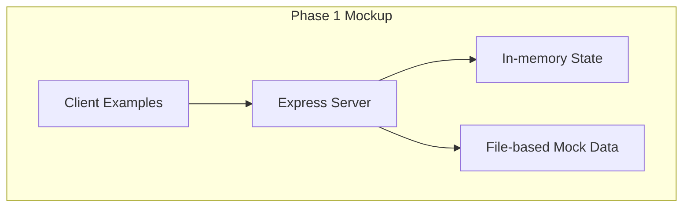
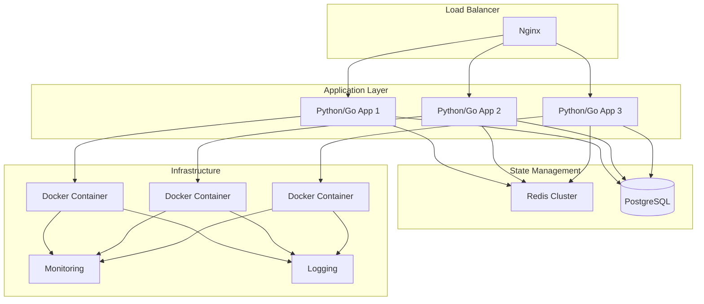

# Phase 2 Transition Plan
## From Mockup to Production Implementation

### 1. Transition Overview

**Current State (Phase 1)**: Lightweight Node.js/Express mockup demonstrating stateless vs stateful concepts
**Target State (Phase 2)**: Production-ready implementation with Docker, Ubuntu, Nginx, and proper infrastructure

**Transition Philosophy**:
- Preserve validated concepts from Phase 1
- Replace mock components with production equivalents
- Maintain clear mapping between mock and production code
- Use Phase 1 as living documentation for Phase 2

### 2. Architecture Evolution

#### 2.1 Current Phase 1 Architecture


#### 2.2 Target Phase 2 Architecture


### 3. Component Mapping Table

| Phase 1 Component | Phase 2 Replacement | Migration Complexity | Notes |
|-------------------|---------------------|----------------------|-------|
| **Express Server** | Python/Go application | Medium | Choose based on team expertise |
| **In-memory sessions** | Redis with persistence | High | Need session replication |
| **Mock user data** | PostgreSQL database | Medium | Schema design required |
| **File-based config** | Environment variables + ConfigMap | Low | Kubernetes/Docker best practices |
| **Basic HTTP** | HTTPS with Nginx termination | Medium | SSL certificates required |
| **Console logging** | Structured logging (JSON) | Low | Integration with ELK stack |
| **Manual testing** | Automated CI/CD pipeline | High | Test automation needed |
| **Single instance** | Docker containers + orchestration | High | Kubernetes or Docker Swarm |

### 4. Technology Stack Selection

#### 4.1 Recommended Stack for Phase 2
- **Application Language**: Python (Django/FastAPI) or Go
  - *Rationale*: Better for network programming, matches Week 01 Python codebase
- **Session Storage**: Redis with Redis Sentinel
  - *Rationale*: High-performance, persistent, supports replication
- **Database**: PostgreSQL
  - *Rationale*: ACID compliance, good for session metadata
- **Web Server**: Nginx
  - *Rationale*: Reverse proxy, load balancing, SSL termination
- **Containerization**: Docker + Docker Compose (development), Kubernetes (production)
- **Monitoring**: Prometheus + Grafana
- **Logging**: ELK Stack (Elasticsearch, Logstash, Kibana)

#### 4.2 Alternative Stacks
- **Option A (Python Focused)**: FastAPI + Redis + PostgreSQL + Nginx
- **Option B (Go Focused)**: Go + Redis + PostgreSQL + Nginx  
- **Option C (Microservices)**: Multiple language services + API Gateway

### 5. Migration Steps

#### Step 1: API Contract Preservation
**Objective**: Ensure Phase 2 implements the same API as Phase 1

**Tasks**:
1. Extract OpenAPI/Swagger specification from Phase 1
2. Create API contract tests that work against both implementations
3. Document all endpoints with request/response examples
4. Create compatibility layer if API changes are needed

**Deliverable**: `api-contract.yaml` that both implementations must satisfy

#### Step 2: Session Management Migration
**Objective**: Replace in-memory sessions with Redis

**Current (Phase 1)**:
```javascript
// In-memory session store
class SessionStore {
  constructor() {
    this.sessions = new Map();
  }
}
```

**Target (Phase 2)**:
```python
# Redis-based session store
import redis
import json

class RedisSessionStore:
    def __init__(self):
        self.redis = redis.Redis(
            host='redis-master',
            port=6379,
            decode_responses=True
        )
    
    def create_session(self, client_data):
        session_id = generate_uuid()
        session_data = {
            'id': session_id,
            'client_data': client_data,
            'created_at': datetime.utcnow().isoformat(),
            'last_activity': datetime.utcnow().isoformat()
        }
        # Store with TTL
        self.redis.setex(
            f"session:{session_id}",
            300,  # 5 minute TTL
            json.dumps(session_data)
        )
        return session_id
```

**Migration Tasks**:
1. Implement Redis session store
2. Add session persistence to database for audit trail
3. Implement session replication for high availability
4. Add session migration for load balancing

#### Step 3: Stateless Handler Implementation
**Objective**: Implement production-ready stateless handlers

**Current (Phase 1)**:
```javascript
// Simple stateless handler
app.get('/api/stateless/info', (req, res) => {
  res.json({ message: "I have no memory" });
});
```

**Target (Phase 2)**:
```python
# Production stateless handler with monitoring
from fastapi import APIRouter, Depends
from prometheus_client import Counter

stateless_requests = Counter('stateless_requests_total', 'Total stateless requests')

router = APIRouter()

@router.get("/api/stateless/info")
async def get_stateless_info():
    stateless_requests.inc()
    return {
        "status": "success",
        "server": "Production Stateless Server",
        "timestamp": datetime.utcnow().isoformat(),
        "metrics": {
            "request_id": generate_request_id(),
            "processing_time_ms": calculate_processing_time()
        }
    }
```

#### Step 4: Infrastructure Setup
**Objective**: Create Docker and Nginx configuration

**Dockerfile**:
```dockerfile
FROM python:3.9-slim

WORKDIR /app
COPY requirements.txt .
RUN pip install --no-cache-dir -r requirements.txt

COPY . .
EXPOSE 8000

# Health check
HEALTHCHECK --interval=30s --timeout=3s --start-period=5s --retries=3 \
  CMD curl -f http://localhost:8000/health || exit 1

CMD ["uvicorn", "main:app", "--host", "0.0.0.0", "--port", "8000"]
```

**docker-compose.yml**:
```yaml
version: '3.8'
services:
  app:
    build: .
    ports:
      - "8000:8000"
    environment:
      - REDIS_HOST=redis
      - DATABASE_URL=postgresql://user:pass@db:5432/app
    depends_on:
      - redis
      - db
  
  redis:
    image: redis:7-alpine
    command: redis-server --appendonly yes
    volumes:
      - redis-data:/data
  
  db:
    image: postgres:15-alpine
    environment:
      POSTGRES_DB: app
      POSTGRES_USER: user
      POSTGRES_PASSWORD: pass
    volumes:
      - postgres-data:/var/lib/postgresql/data
  
  nginx:
    image: nginx:alpine
    ports:
      - "80:80"
      - "443:443"
    volumes:
      - ./nginx.conf:/etc/nginx/nginx.conf
      - ./ssl:/etc/nginx/ssl
    depends_on:
      - app

volumes:
  redis-data:
  postgres-data:
```

**nginx.conf**:
```nginx
events {
    worker_connections 1024;
}

http {
    upstream app_servers {
        server app:8000;
        # Add more servers for load balancing
        # server app2:8000;
        # server app3:8000;
    }
    
    server {
        listen 80;
        server_name localhost;
        
        location / {
            proxy_pass http://app_servers;
            proxy_set_header Host $host;
            proxy_set_header X-Real-IP $remote_addr;
            proxy_set_header X-Forwarded-For $proxy_add_x_forwarded_for;
            proxy_set_header X-Forwarded-Proto $scheme;
        }
        
        location /health {
            access_log off;
            return 200 "healthy\n";
        }
    }
}
```

#### Step 5: Monitoring and Observability
**Objective**: Add production monitoring

**Tasks**:
1. Add Prometheus metrics endpoints
2. Implement structured logging
3. Add distributed tracing
4. Set up health checks
5. Create Grafana dashboards

**Metrics to Collect**:
- Request rate (stateless vs stateful)
- Session count and duration
- Memory usage
- Error rates
- Response times

#### Step 6: Security Implementation
**Objective**: Add production security measures

**Tasks**:
1. Implement HTTPS with Let's Encrypt
2. Add authentication/authorization
3. Implement rate limiting
4. Add input validation and sanitization
5. Set up security headers
6. Implement CSRF protection for stateful endpoints

### 6. Testing Strategy Evolution

#### 6.1 Test Migration
| Phase 1 Test Type | Phase 2 Equivalent | Changes Needed |
|-------------------|-------------------|----------------|
| Unit tests | Same, but with real dependencies | Mock Redis/Database |
| Integration tests | Container-based tests | Docker Compose setup |
| Concept tests | Performance/load tests | Scale testing |
| Manual demos | Automated acceptance tests | Selenium/Playwright |

#### 6.2 New Test Types for Phase 2
1. **Load testing**: Simulate production traffic
2. **Failure testing**: Redis/Database failure scenarios
3. **Security testing**: Penetration testing
4. **Performance testing**: Benchmark against requirements
5. **Chaos testing**: Random failure injection

### 7. Deployment Strategy

#### 7.1 Development Environment
```bash
# Phase 1 (Mockup)
npm start

# Phase 2 (Production-like)
docker-compose up --build
```

#### 7.2 Staging Environment
- Docker containers on single host
- Nginx load balancer
- Redis with persistence
- PostgreSQL database
- Basic monitoring

#### 7.3 Production Environment
- Kubernetes cluster
- Multiple availability zones
- Redis Sentinel for high availability
- PostgreSQL replication
- CDN for static assets
- WAF (Web Application Firewall)

### 8. Rollback Plan

#### 8.1 Canary Deployment
1. Deploy Phase 2 to 10% of traffic
2. Monitor metrics closely
3. Gradually increase to 100%
4. Roll back if error rate exceeds threshold

#### 8.2 Rollback Triggers
- Error rate > 1%
- Response time increase > 50%
- Session loss detected
- Memory leak identified

#### 8.3 Rollback Procedure
```bash
# Revert to Phase 1 if needed
kubectl rollout undo deployment/stateless-stateful-app
```

### 9. Performance Considerations

#### 9.1 Expected Improvements
| Metric | Phase 1 | Phase 2 Target | Improvement Factor |
|--------|---------|----------------|-------------------|
| Requests/sec | ~100 | ~1000 | 10x |
| Session capacity | ~100 | ~10,000 | 100x |
| Availability | 90% | 99.9% | 10x more reliable |
| Latency | 50-100ms | 10-50ms | 2-5x faster |

#### 9.2 Scaling Strategy
- **Stateless scaling**: Horizontal scaling (add more instances)
- **Stateful scaling**: Session affinity + Redis clustering
- **Database scaling**: Read replicas + connection pooling
- **Cache scaling**: Redis cluster with sharding

### 10. Documentation Updates

#### 10.1 Documents to Create
1. **Architecture Decision Record (ADR)**: Why chosen technologies
2. **API Reference**: Complete OpenAPI documentation
3. **Deployment Guide**: Step-by-step deployment instructions
4. **Operational Runbook**: Troubleshooting and maintenance
5. **Performance Benchmarks**: Comparison with Phase 1

#### 10.2 Documents to Update
1. **README.md**: New setup instructions
2. **Testing Guide**: Updated for production tests
3. **Development Guide**: New development workflow
4. **Monitoring Guide**: How to use monitoring tools

### 11. Timeline and Milestones

#### Week 1: Foundation
- [ ] Choose technology stack
- [ ] Set up development environment
- [ ] Create basic Docker setup
- [ ] Implement database schema

#### Week 2: Core Implementation
- [ ] Port stateless endpoints
- [ ] Implement Redis session store
- [ ] Add basic authentication
- [ ] Set up Nginx configuration

#### Week 3: Advanced Features
- [ ] Implement monitoring
- [ ] Add security features
- [ ] Create deployment pipeline
- [ ] Performance testing

#### Week 4: Polish and Deployment
- [ ] Load testing
- [ ] Documentation completion
- [ ] Staging deployment
- [ ] Production rollout

### 12. Risk Assessment and Mitigation

#### 12.1 Technical Risks
| Risk | Probability | Impact | Mitigation |
|------|------------|--------|------------|
| Session data loss | Medium | High | Redis persistence + database backup |
| Performance degradation | High | Medium | Load testing before deployment |
| Database bottlenecks | Medium | High | Connection pooling + indexing |
| Container orchestration complexity | High | High | Start with Docker Compose, then Kubernetes |

#### 12.2 Operational Risks
| Risk | Probability | Impact | Mitigation |
|------|------------|--------|------------|
| Team skill gap | Medium | High | Training + pair programming |
| Timeline slippage | High | Medium | Agile sprints + MVP approach |
| Production issues | Low | High | Comprehensive monitoring + rollback plan |

### 13. Success Criteria

#### 13.1 Technical Success
- [ ] All Phase 1 endpoints implemented in Phase 2
- [ ] Performance meets or exceeds targets
- [ ] No data loss in session migration
- [ ] Monitoring provides actionable insights
- [ ] Security audit passes

#### 13.2 Business Success
- [ ] Concepts clearly demonstrated in production
- [ ] System handles expected load
- [ ] Operational costs within budget
- [ ] Team can maintain and extend system

#### 13.3 Educational Success
- [ ] Clear comparison between Phase 1 and Phase 2
- [ ] Architecture decisions well-documented
- [ ] Team understands trade-offs made
- [ ] System serves as learning example

### 14. Next Steps

#### Immediate Actions (Week 1):
1. Review and finalize technology choices
2. Set up Phase 2 project structure
3. Create Docker development environment
4. Begin API contract implementation

#### Medium-term Actions (Weeks 2-3):
1. Implement core functionality
2. Set up CI/CD pipeline
3. Begin performance testing
4. Create documentation

#### Long-term Actions (Week 4+):
1. Production deployment
2. Load testing at scale
3. Monitoring optimization
4. Team training and handover

### 15. Conclusion

The transition from Phase 1 mockup to Phase 2 production implementation represents a significant step in maturity. While Phase 1 focused on concept validation and education, Phase 2 focuses on production readiness, scalability, and maintainability.

**Key Transition Principles**:
1. **Preserve validated concepts**: Don't change what works
2. **Incremental migration**: Move component by component
3. **Continuous validation**: Test at each step
4. **Document decisions**: Create living documentation

By following this transition plan, the team can successfully evolve the stateless vs stateful demonstration from a simple mockup to a production-ready system that serves both educational and practical purposes.