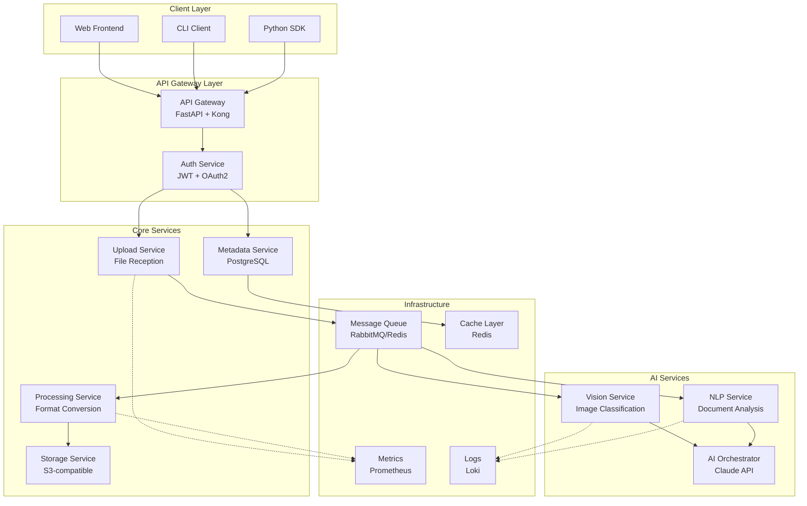

# WEEK 03 — Application Protocol Design: Building Cloud-Native Microservices

> If Week 01 taught obedience and Week 02 taught memory,
> Week 03 teaches **language**.
>
> Not the language of machines.
> The language of **distributed systems that never stop**.

---

## 1. Teaching Intent (Instructor Note)

Week 03 is the **inflection point**.

Previous weeks built understanding:
- TCP mechanics (Week 01)
- Session management (Week 02)

This week builds **careers**.

Students must now think as:
- **Protocol Designers** — defining contracts between services
- **Microservice Architects** — decomposing monoliths into distributed systems
- **Cloud Engineers** — deploying resilient, scalable infrastructure
- **AI-Native Developers** — integrating LLMs as first-class service citizens

This is not incremental improvement.
This is **paradigm shift**.

### 1.1 Core Philosophy

Real-world systems are not single servers.
They are **constellations of cooperating services**.

Each service:
- Owns its domain
- Exposes well-defined interfaces
- Fails independently
- Scales independently
- Deploys independently

This week, students stop writing programs.
They start **orchestrating ecosystems**.

---

## 2. The Zero-to-Hero Framework

### 2.1 The Learning Spiral

```
WEEK 01: Single socket, single file, single transfer
         ↓
WEEK 02: Single connection, multiple transfers, session memory
         ↓
WEEK 03: Multiple services, multiple protocols, distributed state
         ↓
BEYOND: Production-grade cloud-native architecture
```

### 2.2 Pedagogical Architecture

We teach three layers simultaneously:

**Layer 1: Protocol Design** (What services say)
- RESTful HTTP APIs
- WebSocket real-time channels
- gRPC for inter-service communication
- Message queues for async workflows

**Layer 2: Service Architecture** (How services cooperate)
- Decomposition principles
- Service mesh patterns
- Event-driven architecture
- CQRS and Event Sourcing

**Layer 3: Cloud Operations** (Where services live)
- Containerization (Docker)
- Orchestration (Kubernetes)
- Observability (Logging, Metrics, Tracing)
- GitOps deployment pipelines

---

## 3. Week 03 Architecture: The File Processing Microservice Ecosystem

### 3.1 System Overview

Students will build a **distributed file processing platform** that extends Week 01-02 concepts into a cloud-native microservice architecture.



### 3.2 Service Responsibilities

#### 3.2.1 API Gateway (Entry Point)
**Technology**: FastAPI + Kong/Traefik
**Responsibilities**:
- Request routing and load balancing
- Rate limiting and throttling
- API versioning
- Request/response transformation
- CORS and security headers

**Protocol**: HTTP/2, REST, WebSocket

**Key Learning**: Single entry point, protocol translation, traffic management

---

#### 3.2.2 Upload Service (File Ingestion)
**Technology**: FastAPI + aiofiles
**Responsibilities**:
- Multipart file upload handling
- MIME type validation (extends Week 01)
- Chunk-based streaming for large files
- Presigned URL generation
- Upload resumption support

**Protocol**: REST API with streaming

**Endpoints**:
```
POST   /v1/uploads/initiate     → Start multipart upload
PUT    /v1/uploads/{id}/chunk   → Upload file chunk
POST   /v1/uploads/{id}/complete → Finalize upload
DELETE /v1/uploads/{id}          → Cancel upload
GET    /v1/uploads/{id}/status   → Check upload progress
```

**Key Learning**: Streaming protocols, chunked transfer, state management

---

#### 3.2.3 Processing Service (File Transformation)
**Technology**: Python + Celery workers
**Responsibilities**:
- Image format conversion (PNG→WEBP, JPEG→PNG)
- Document processing (PDF→text, DOCX→PDF)
- Video transcoding (MP4→HLS)
- Archive handling (ZIP, TAR)
- Thumbnail generation

**Protocol**: Async job queue (RabbitMQ/Redis)

**Message Format**:
```json
{
  "job_id": "uuid-v4",
  "task": "convert_image",
  "source": "s3://bucket/input.png",
  "destination": "s3://bucket/output.webp",
  "parameters": {
    "format": "webp",
    "quality": 85,
    "max_width": 1920
  },
  "callback_url": "https://api/v1/jobs/{job_id}/complete",
  "priority": 5,
  "max_retries": 3
}
```

**Key Learning**: Async workflows, worker pools, retry logic, idempotency

---

#### 3.2.4 Storage Service (Persistence Layer)
**Technology**: MinIO (S3-compatible) + SQLite/PostgreSQL metadata
**Responsibilities**:
- Object storage with versioning
- Metadata indexing
- Access control (pre-signed URLs)
- Storage tiering (hot/cold)
- Automatic cleanup and lifecycle management

**Protocol**: S3 API + Custom REST API

**Key Learning**: Object storage patterns, CAP theorem trade-offs, eventual consistency

---

#### 3.2.5 Metadata Service (System of Record)
**Technology**: PostgreSQL + Redis cache
**Responsibilities**:
- File metadata (size, type, owner, timestamps)
- Processing history and lineage
- Search indexing
- User preferences (from Week 02 sessions)
- Audit logs

**Protocol**: REST API + GraphQL (optional)

**Schema**:
```sql
CREATE TABLE files (
    id UUID PRIMARY KEY,
    user_id UUID NOT NULL,
    filename VARCHAR(255),
    mime_type VARCHAR(100),
    size_bytes BIGINT,
    storage_path TEXT,
    upload_session_id UUID,  -- Links to Week 02
    status VARCHAR(50),
    created_at TIMESTAMP,
    updated_at TIMESTAMP,
    metadata JSONB
);

CREATE TABLE processing_jobs (
    id UUID PRIMARY KEY,
    file_id UUID REFERENCES files(id),
    task_type VARCHAR(100),
    status VARCHAR(50),
    started_at TIMESTAMP,
    completed_at TIMESTAMP,
    error_message TEXT,
    result JSONB
);
```

**Key Learning**: Database design, caching strategies, ACID vs BASE

---

#### 3.2.6 Vision Service (AI-Powered Image Analysis)
**Technology**: FastAPI + OpenCV + PIL + Claude API
**Responsibilities**:
- Image classification
- Object detection
- OCR (text extraction from images)
- Content moderation
- Smart cropping and composition analysis

**Protocol**: REST API

**Integration Pattern**:
```python
# Hybrid approach: Local CV + Cloud AI
async def analyze_image(image_path):
    # Fast local analysis
    local_features = await extract_features_opencv(image_path)
    
    # Rich AI analysis via Claude
    if local_features['complexity'] > threshold:
        claude_analysis = await claude_vision_analyze(image_path)
        return merge_results(local_features, claude_analysis)
    
    return local_features
```

**Key Learning**: AI service integration, cost optimization, fallback strategies

---

#### 3.2.7 NLP Service (Document Intelligence)
**Technology**: FastAPI + spaCy + Claude API
**Responsibilities**:
- Document summarization
- Entity extraction
- Sentiment analysis
- Language detection
- Content categorization

**Protocol**: REST API + gRPC for high-throughput

**Key Learning**: NLP pipelines, model serving, streaming responses

---

#### 3.2.8 AI Orchestrator (Claude Integration)
**Technology**: Python + Anthropic SDK + LangChain
**Responsibilities**:
- Prompt engineering and optimization
- Multi-turn conversations
- Tool use coordination
- Response caching
- Cost tracking and optimization

**Pattern**: Agentic AI with human-in-the-loop

**Example Workflow**:
```python
async def process_document_with_ai(file_id):
    # 1. Extract text
    text = await extract_text(file_id)
    
    # 2. Initial analysis
    analysis = await claude_analyze(text)
    
    # 3. If confidence low, request human review
    if analysis['confidence'] < 0.8:
        await request_human_review(file_id, analysis)
        return {'status': 'pending_review'}
    
    # 4. Execute recommendations
    await execute_actions(analysis['recommendations'])
    return {'status': 'completed', 'analysis': analysis}
```

**Key Learning**: AI orchestration, HITL patterns, cost management

---

### 3.3 Cross-Cutting Concerns

#### 3.3.1 Observability Stack

**Logging**: Structured JSON logs with correlation IDs
```python
logger.info("File uploaded", extra={
    'correlation_id': request_id,
    'user_id': user.id,
    'file_size': file.size,
    'mime_type': file.mime_type,
    'service': 'upload',
    'timestamp': datetime.utcnow().isoformat()
})
```

**Metrics**: Prometheus + Grafana
```python
from prometheus_client import Counter, Histogram

upload_counter = Counter('uploads_total', 'Total uploads', ['status'])
upload_duration = Histogram('upload_duration_seconds', 'Upload duration')

@upload_duration.time()
async def handle_upload(file):
    try:
        result = await process_upload(file)
        upload_counter.labels(status='success').inc()
        return result
    except Exception as e:
        upload_counter.labels(status='error').inc()
        raise
```

**Tracing**: OpenTelemetry + Jaeger
```python
from opentelemetry import trace

tracer = trace.get_tracer(__name__)

async def upload_file(file):
    with tracer.start_as_current_span("upload_file") as span:
        span.set_attribute("file.size", file.size)
        span.set_attribute("file.type", file.mime_type)
        
        # Propagate context to downstream services
        result = await storage_service.save(file)
        return result
```

---

#### 3.3.2 Service Communication Patterns

**Synchronous (REST)**:
- Request-response for real-time queries
- Short-lived operations (<5 seconds)
- User-facing APIs

**Asynchronous (Message Queue)**:
- Long-running processing tasks
- Fire-and-forget workflows
- Event-driven architectures

**Event Streaming (Optional: Kafka/Pulsar)**:
- Real-time analytics
- Event sourcing
- CQRS patterns

---

## 4. Implementation Roadmap

### Phase 1: Foundation (Days 1-3)

#### 4.1.1 Containerization
**Objective**: Package each service as a Docker container

**Tasks**:
- [ ] Create Dockerfile for each service
- [ ] Docker Compose for local development
- [ ] Health check endpoints
- [ ] Environment-based configuration

**Deliverable**: `mockup-infra` configuration with Week 03 profile, enabling a containerized microservice ecosystem with Nginx routing.

**Example Dockerfile**:
```dockerfile
FROM python:3.11-slim

WORKDIR /app

# Install dependencies
COPY requirements.txt .
RUN pip install --no-cache-dir -r requirements.txt

# Copy application
COPY . .

# Health check
HEALTHCHECK --interval=30s --timeout=3s \
  CMD curl -f http://localhost:8000/health || exit 1

EXPOSE 8000

CMD ["uvicorn", "main:app", "--host", "0.0.0.0", "--port", "8000"]
```

---

#### 4.1.2 Service Skeleton
**Objective**: Create minimal working version of each service

**Upload Service Template**:
```python
from fastapi import FastAPI, UploadFile, File
from fastapi.responses import JSONResponse
import uuid
from datetime import datetime

app = FastAPI(title="Upload Service", version="1.0.0")

@app.post("/v1/uploads/initiate")
async def initiate_upload(filename: str, size: int, mime_type: str):
    upload_id = str(uuid.uuid4())
    
    # Store upload metadata
    upload_meta = {
        'id': upload_id,
        'filename': filename,
        'size': size,
        'mime_type': mime_type,
        'status': 'initiated',
        'created_at': datetime.utcnow().isoformat()
    }
    
    # TODO: Save to metadata service
    
    return JSONResponse({
        'upload_id': upload_id,
        'chunk_size': 5242880,  # 5MB chunks
        'expires_at': (datetime.utcnow() + timedelta(hours=1)).isoformat()
    })

@app.put("/v1/uploads/{upload_id}/chunk")
async def upload_chunk(
    upload_id: str,
    chunk_index: int,
    file: UploadFile = File(...)
):
    # TODO: Validate upload_id exists
    # TODO: Save chunk to temporary storage
    # TODO: Update progress
    
    return {'status': 'chunk_received', 'chunk_index': chunk_index}

@app.post("/v1/uploads/{upload_id}/complete")
async def complete_upload(upload_id: str):
    # TODO: Reassemble chunks
    # TODO: Move to permanent storage
    # TODO: Trigger processing pipeline
    
    return {'status': 'completed', 'file_id': str(uuid.uuid4())}

@app.get("/health")
async def health():
    return {'status': 'healthy'}
```

---

### Phase 2: Inter-Service Communication (Days 4-6)

#### 4.2.1 Message Queue Integration
**Technology**: RabbitMQ (simple) or Redis Streams (lightweight)

**Producer Pattern**:
```python
import aio_pika
import json

async def publish_processing_job(job_data):
    connection = await aio_pika.connect_robust("amqp://rabbitmq/")
    
    async with connection:
        channel = await connection.channel()
        
        await channel.default_exchange.publish(
            aio_pika.Message(
                body=json.dumps(job_data).encode(),
                delivery_mode=aio_pika.DeliveryMode.PERSISTENT
            ),
            routing_key='processing.queue'
        )
```

**Consumer Pattern**:
```python
async def consume_processing_jobs():
    connection = await aio_pika.connect_robust("amqp://rabbitmq/")
    
    async with connection:
        channel = await connection.channel()
        queue = await channel.declare_queue('processing.queue', durable=True)
        
        async with queue.iterator() as queue_iter:
            async for message in queue_iter:
                async with message.process():
                    job = json.loads(message.body)
                    await process_file(job)
```

---

#### 4.2.2 Service Discovery
**For Local Dev**: Docker network DNS
**For Production**: Kubernetes DNS or Consul

**Configuration**:
```yaml
# docker-compose.yml
services:
  upload-service:
    build: ./upload-service
    environment:
      - METADATA_SERVICE_URL=http://metadata-service:8001
      - STORAGE_SERVICE_URL=http://storage-service:8002
    depends_on:
      - metadata-service
      - storage-service
```

---

### Phase 3: Cloud Deployment (Days 7-9)

#### 4.3.1 Kubernetes Deployment
**Objective**: Deploy to local Kubernetes (minikube) or cloud (GKE, EKS, AKS)

**Deployment Manifest**:
```yaml
apiVersion: apps/v1
kind: Deployment
metadata:
  name: upload-service
spec:
  replicas: 3
  selector:
    matchLabels:
      app: upload-service
  template:
    metadata:
      labels:
        app: upload-service
    spec:
      containers:
      - name: upload-service
        image: your-registry/upload-service:latest
        ports:
        - containerPort: 8000
        env:
        - name: DATABASE_URL
          valueFrom:
            secretKeyRef:
              name: db-credentials
              key: url
        resources:
          requests:
            memory: "128Mi"
            cpu: "100m"
          limits:
            memory: "256Mi"
            cpu: "500m"
        livenessProbe:
          httpGet:
            path: /health
            port: 8000
          initialDelaySeconds: 30
          periodSeconds: 10
        readinessProbe:
          httpGet:
            path: /health
            port: 8000
          initialDelaySeconds: 5
          periodSeconds: 5
---
apiVersion: v1
kind: Service
metadata:
  name: upload-service
spec:
  selector:
    app: upload-service
  ports:
  - protocol: TCP
    port: 80
    targetPort: 8000
  type: ClusterIP
```

**Horizontal Pod Autoscaling**:
```yaml
apiVersion: autoscaling/v2
kind: HorizontalPodAutoscaler
metadata:
  name: upload-service-hpa
spec:
  scaleTargetRef:
    apiVersion: apps/v1
    kind: Deployment
    name: upload-service
  minReplicas: 2
  maxReplicas: 10
  metrics:
  - type: Resource
    resource:
      name: cpu
      target:
        type: Utilization
        averageUtilization: 70
```

---

#### 4.3.2 CI/CD Pipeline
**Technology**: GitHub Actions + ArgoCD

**Build and Push**:
```yaml
# .github/workflows/build.yml
name: Build and Deploy

on:
  push:
    branches: [main]

jobs:
  build:
    runs-on: ubuntu-latest
    steps:
    - uses: actions/checkout@v3
    
    - name: Build Docker image
      run: |
        docker build -t ${{ secrets.REGISTRY }}/upload-service:${{ github.sha }} ./upload-service
    
    - name: Push to registry
      run: |
        echo ${{ secrets.REGISTRY_PASSWORD }} | docker login -u ${{ secrets.REGISTRY_USER }} --password-stdin
        docker push ${{ secrets.REGISTRY }}/upload-service:${{ github.sha }}
    
    - name: Update K8s manifest
      run: |
        cd k8s
        kustomize edit set image upload-service=${{ secrets.REGISTRY }}/upload-service:${{ github.sha }}
        git commit -am "Update upload-service to ${{ github.sha }}"
        git push
```

**GitOps Deployment**: ArgoCD watches Git repo and auto-deploys

---

### Phase 4: AI Integration (Days 10-12)

#### 4.4.1 Claude API Integration
**Objective**: Add AI-powered document analysis

**Vision Analysis Service**:
```python
from anthropic import Anthropic
import base64

client = Anthropic(api_key=os.environ['ANTHROPIC_API_KEY'])

async def analyze_image_with_claude(image_path: str):
    # Read and encode image
    with open(image_path, 'rb') as f:
        image_data = base64.b64encode(f.read()).decode()
    
    response = client.messages.create(
        model="claude-sonnet-4-20250514",
        max_tokens=1000,
        messages=[{
            "role": "user",
            "content": [
                {
                    "type": "image",
                    "source": {
                        "type": "base64",
                        "media_type": "image/jpeg",
                        "data": image_data
                    }
                },
                {
                    "type": "text",
                    "text": "Analyze this image. Provide: 1) Main subject, 2) Key objects, 3) Text if any, 4) Suggested tags, 5) Content category"
                }
            ]
        }]
    )
    
    return parse_claude_response(response.content[0].text)
```

**HITL Pattern**:
```python
async def process_with_human_oversight(file_id: str):
    # AI does initial analysis
    ai_result = await claude_analyze(file_id)
    
    # Check confidence threshold
    if ai_result['confidence'] < 0.85:
        # Queue for human review
        review_id = await create_review_task(file_id, ai_result)
        
        # Notify human reviewer
        await notify_reviewer(review_id)
        
        # Wait for human decision (async)
        return {'status': 'pending_review', 'review_id': review_id}
    
    # Auto-approve high-confidence results
    await finalize_processing(file_id, ai_result)
    return {'status': 'completed', 'result': ai_result}
```

---

#### 4.4.2 Cost Optimization
**Strategy**: Cache + Rate Limiting + Smart Routing

```python
from functools import lru_cache
import hashlib

# Cache similar requests
@lru_cache(maxsize=1000)
async def cached_claude_call(prompt_hash: str):
    return await call_claude_api(prompt_hash)

# Smart routing: use local models for simple tasks
async def smart_analyze(image_path: str):
    # Quick local check
    local_score = await simple_classification(image_path)
    
    # Only use Claude for complex cases
    if local_score['complexity'] > 0.7:
        return await analyze_image_with_claude(image_path)
    
    return local_score

# Rate limiting per user/tier
from fastapi_limiter import FastAPILimiter
from fastapi_limiter.depends import RateLimiter

@app.post("/v1/ai/analyze", dependencies=[Depends(RateLimiter(times=10, seconds=60))])
async def analyze_endpoint(file_id: str):
    return await smart_analyze(file_id)
```

---

### Phase 5: Team Collaboration (Days 13-15)

#### 4.5.1 Agile/Scrum Structure

**Team Organization**:
```
Squad: File Processing Platform (5-7 students)
├── Product Owner (1) - Defines features, prioritizes backlog
├── Scrum Master (1) - Facilitates ceremonies, removes blockers
└── Development Team (3-5)
    ├── Backend Engineers (2) - API services
    ├── DevOps Engineer (1) - Infrastructure, deployment
    ├── Frontend Engineer (1) - Web UI (optional)
    └── AI/ML Engineer (1) - Claude integration, model optimization
```

**Sprint Structure**:
- **Sprint Length**: 1 week
- **Daily Standup**: 15 minutes
- **Sprint Planning**: Define sprint backlog from course objectives
- **Sprint Review**: Demo working software to instructor
- **Sprint Retro**: Improve process

**Example Sprint Backlog**:
```
Sprint 1 (Week 03)
┌─────────────────────────────────────────────────┐
│ User Story                        │ Points │ Owner    │
├─────────────────────────────────────────────────┤
│ As a user, I can upload files    │   5    │ Alice    │
│ As a system, I process images    │   8    │ Bob      │
│ As a dev, services are deployed  │   13   │ Charlie  │
│ As a user, I see upload progress │   3    │ Alice    │
└─────────────────────────────────────────────────┘
Total: 29 points (Target: 25-30 for first sprint)
```

---

#### 4.5.2 SAFe Alignment (Multi-Team Scale)

**For courses with multiple squads**:

```
Program Increment (PI): 3 weeks (Week 03-05)
├── Week 03: Foundation Sprint
│   ├── Squad A: Upload + Storage services
│   ├── Squad B: Processing + AI services
│   └── Squad C: Infrastructure + Observability
├── Week 04: Integration Sprint
│   └── All squads: API integration, testing
└── Week 05: Hardening Sprint
    └── All squads: Performance, security, docs
```

**Program-Level Objectives**:
1. **Architectural Runway**: Shared infrastructure (K8s cluster, CI/CD)
2. **Cross-Team Dependencies**: API contracts, message formats
3. **Innovation Sprint**: 20% time for experimentation

---

#### 4.5.3 Communication Protocols

**Slack Channels**:
- `#week03-general` - Team coordination
- `#week03-backend` - API discussions
- `#week03-devops` - Infrastructure issues
- `#week03-ai` - Claude integration
- `#week03-blockers` - Urgent help needed

**Documentation**:
- **API Specs**: OpenAPI/Swagger
- **Architecture Decisions**: ADR (Architecture Decision Records)
- **Runbooks**: Deployment, troubleshooting guides

**Code Review Standards**:
- All changes via Pull Request
- At least 1 approval required
- Automated tests must pass
- No secrets in code

---

## 5. Protocol Design Deep Dive

### 5.1 RESTful API Design Principles

#### 5.1.1 Resource Naming
```
✅ Good:
GET    /v1/files
POST   /v1/files
GET    /v1/files/{id}
PUT    /v1/files/{id}
DELETE /v1/files/{id}

❌ Bad:
GET    /v1/getFiles
POST   /v1/createFile
GET    /v1/file?id={id}
```

#### 5.1.2 HTTP Status Codes
```python
from fastapi import HTTPException, status

@app.post("/v1/files", status_code=status.HTTP_201_CREATED)
async def create_file(file: UploadFile):
    if file.size > MAX_SIZE:
        raise HTTPException(
            status_code=status.HTTP_413_REQUEST_ENTITY_TOO_LARGE,
            detail="File too large"
        )
    
    if not is_allowed_type(file.content_type):
        raise HTTPException(
            status_code=status.HTTP_415_UNSUPPORTED_MEDIA_TYPE,
            detail=f"Type {file.content_type} not allowed"
        )
    
    try:
        result = await save_file(file)
        return result
    except StorageError:
        raise HTTPException(
            status_code=status.HTTP_503_SERVICE_UNAVAILABLE,
            detail="Storage service unavailable"
        )
```

---

### 5.2 Message Queue Protocol

#### 5.2.1 Message Structure
```json
{
  "message_id": "uuid-v4",
  "correlation_id": "request-trace-id",
  "timestamp": "2026-02-07T10:30:00Z",
  "source_service": "upload-service",
  "destination_service": "processing-service",
  "message_type": "file.uploaded",
  "payload": {
    "file_id": "uuid-v4",
    "mime_type": "image/png",
    "size_bytes": 1048576,
    "storage_url": "s3://bucket/files/uuid.png"
  },
  "metadata": {
    "user_id": "user-uuid",
    "tenant_id": "tenant-uuid",
    "priority": 5
  },
  "retry_count": 0,
  "max_retries": 3
}
```

#### 5.2.2 Idempotency Pattern
```python
import hashlib

def generate_idempotency_key(job_data):
    """Ensure duplicate messages don't create duplicate work"""
    content = f"{job_data['file_id']}:{job_data['task_type']}"
    return hashlib.sha256(content.encode()).hexdigest()

async def process_message(message):
    idempotency_key = generate_idempotency_key(message['payload'])
    
    # Check if already processed
    if await redis.exists(f"processed:{idempotency_key}"):
        logger.info(f"Skipping duplicate message: {idempotency_key}")
        return
    
    # Process
    result = await do_work(message['payload'])
    
    # Mark as processed (with expiration)
    await redis.setex(f"processed:{idempotency_key}", 86400, "1")
    
    return result
```

---

### 5.3 WebSocket Protocol (Real-Time Updates)

**Use Case**: Live upload progress

```python
from fastapi import WebSocket, WebSocketDisconnect
from typing import Dict
import asyncio

class ConnectionManager:
    def __init__(self):
        self.active_connections: Dict[str, WebSocket] = {}
    
    async def connect(self, upload_id: str, websocket: WebSocket):
        await websocket.accept()
        self.active_connections[upload_id] = websocket
    
    def disconnect(self, upload_id: str):
        if upload_id in self.active_connections:
            del self.active_connections[upload_id]
    
    async def send_progress(self, upload_id: str, progress: dict):
        if upload_id in self.active_connections:
            await self.active_connections[upload_id].send_json(progress)

manager = ConnectionManager()

@app.websocket("/v1/uploads/{upload_id}/progress")
async def upload_progress(websocket: WebSocket, upload_id: str):
    await manager.connect(upload_id, websocket)
    try:
        while True:
            # Keep connection alive
            await websocket.receive_text()
    except WebSocketDisconnect:
        manager.disconnect(upload_id)

# In upload handler
async def handle_chunk_upload(upload_id, chunk_index, total_chunks):
    progress = {
        'upload_id': upload_id,
        'chunks_uploaded': chunk_index + 1,
        'total_chunks': total_chunks,
        'percentage': ((chunk_index + 1) / total_chunks) * 100
    }
    await manager.send_progress(upload_id, progress)
```

---

## 6. Production Readiness Checklist

### 6.1 Security

- [ ] All secrets in environment variables (never in code)
- [ ] API authentication (JWT tokens)
- [ ] Rate limiting on all endpoints
- [ ] Input validation and sanitization
- [ ] HTTPS/TLS for all external traffic
- [ ] CORS configured correctly
- [ ] SQL injection prevention (parameterized queries)
- [ ] File upload size limits
- [ ] Virus scanning for uploaded files
- [ ] Security headers (CSP, HSTS, X-Frame-Options)

---

### 6.2 Reliability

- [ ] Health checks on all services
- [ ] Circuit breakers for external dependencies
- [ ] Graceful shutdown handling
- [ ] Request timeouts
- [ ] Retry logic with exponential backoff
- [ ] Dead letter queues for failed messages
- [ ] Database connection pooling
- [ ] Caching for expensive operations
- [ ] Load balancing across replicas

---

### 6.3 Observability

- [ ] Structured logging (JSON format)
- [ ] Correlation IDs across requests
- [ ] Metrics for all key operations
- [ ] Distributed tracing
- [ ] Alerting for critical errors
- [ ] Dashboard for system health
- [ ] Performance monitoring (latency, throughput)
- [ ] Error tracking (Sentry or similar)

---

### 6.4 Operational Excellence

- [ ] Automated deployment pipeline
- [ ] Rollback capability
- [ ] Feature flags for gradual rollout
- [ ] Database migrations automated
- [ ] Backup and restore procedures
- [ ] Disaster recovery plan
- [ ] Load testing completed
- [ ] Security scanning in CI/CD
- [ ] Documentation up to date
- [ ] Runbooks for common incidents

---

## 7. Assessment Criteria

### 7.1 Technical Excellence (40%)

**Architecture (15%)**:
- [ ] Clean service boundaries
- [ ] Appropriate protocol choices
- [ ] Scalable design
- [ ] Proper error handling

**Code Quality (15%)**:
- [ ] PEP 8 compliance
- [ ] Type hints used
- [ ] Comprehensive tests (80%+ coverage)
- [ ] Clear documentation

**Infrastructure (10%)**:
- [ ] Services containerized
- [ ] Deployed to Kubernetes
- [ ] CI/CD pipeline functional
- [ ] Observability implemented

---

### 7.2 Cloud-Native Practices (30%)

**Microservice Design (15%)**:
- [ ] Single Responsibility per service
- [ ] Database per service
- [ ] API-first design
- [ ] Backward compatibility

**Resilience (10%)**:
- [ ] Graceful degradation
- [ ] Circuit breakers
- [ ] Retry logic
- [ ] Chaos testing (bonus)

**Scalability (5%)**:
- [ ] Horizontal scaling demonstrated
- [ ] Stateless services
- [ ] Load testing results

---

### 7.3 AI Integration (15%)

**Claude Integration (10%)**:
- [ ] Proper API usage
- [ ] Cost optimization
- [ ] Error handling
- [ ] Response caching

**HITL Implementation (5%)**:
- [ ] Human review workflow
- [ ] Confidence thresholds
- [ ] Feedback loop

---

### 7.4 Team Collaboration (15%)

**Agile Practices (10%)**:
- [ ] Sprint planning completed
- [ ] Daily standups held
- [ ] User stories defined
- [ ] Sprint retrospective

**Communication (5%)**:
- [ ] Clear API documentation
- [ ] Code reviews conducted
- [ ] ADRs written
- [ ] Knowledge sharing

---

## 8. Student Deliverables

### 8.1 Code Repository
**Structure**:
```
week03-microservices/
├── services/
│   ├── upload/
│   ├── processing/
│   ├── storage/
│   ├── metadata/
│   └── ai-orchestrator/
├── k8s/
│   ├── deployments/
│   ├── services/
│   └── configmaps/
├── docker-compose.yml
├── .github/workflows/
├── docs/
│   ├── API.md
│   ├── ARCHITECTURE.md
│   └── DEPLOYMENT.md
└── README.md
```

---

### 8.2 Documentation
1. **Architecture Document** (2-3 pages)
   - System diagram
   - Service responsibilities
   - Protocol choices and rationale
   - Technology decisions

2. **API Documentation** (auto-generated + narrative)
   - OpenAPI specs
   - Example requests/responses
   - Error codes
   - Rate limits

3. **Deployment Guide**
   - Prerequisites
   - Configuration
   - Step-by-step deployment
   - Troubleshooting

4. **Sprint Report**
   - Sprint goals
   - Completed stories
   - Challenges faced
   - Lessons learned

---

### 8.3 Demo Video (5 minutes)
- System overview
- Live deployment
- Key features demonstration
- AI integration showcase
- Team reflection

---

## 9. Success Metrics

### 9.1 Functional Requirements
- ✅ Upload files via REST API
- ✅ Process files asynchronously
- ✅ Store files in object storage
- ✅ AI-powered analysis
- ✅ Real-time progress updates
- ✅ Multiple file format support

### 9.2 Non-Functional Requirements
- **Performance**: Handle 100 concurrent uploads
- **Availability**: 99% uptime during demo
- **Latency**: <500ms API response time (p95)
- **Scalability**: Auto-scale based on load
- **Security**: No secrets in code, HTTPS enforced

### 9.3 Learning Outcomes
- ✓ Understand microservice architecture
- ✓ Design RESTful APIs
- ✓ Deploy to Kubernetes
- ✓ Implement observability
- ✓ Integrate AI services
- ✓ Collaborate in Agile teams

---

## 10. Extensions and Advanced Topics

### 10.1 Week 04 Preview: Authentication & Authorization
- OAuth2 + JWT implementation
- Role-based access control (RBAC)
- Multi-tenancy support
- API key management

### 10.2 Week 05 Preview: Event-Driven Architecture
- Event sourcing patterns
- CQRS implementation
- Saga patterns for distributed transactions
- Kafka/Pulsar integration

### 10.3 Optional Challenges
- **GraphQL Gateway**: Replace REST with GraphQL
- **Service Mesh**: Implement Istio/Linkerd
- **Chaos Engineering**: Use Chaos Mesh for resilience testing
- **Multi-Region**: Deploy to multiple cloud regions
- **Cost Dashboard**: Track cloud spending per service

---

## 11. Instructor Resources

### 11.1 Teaching Tips

**Day 1-3**: Focus on fundamentals
- Students will be overwhelmed - this is normal
- Emphasize: "You don't need to know everything, just know where to look"
- Live code the first service together
- Celebrate small wins (first container, first deployment)

**Day 4-6**: Encourage experimentation
- Let teams make mistakes
- Guide but don't solve for them
- Use failures as teaching moments
- Share debugging strategies

**Day 7-9**: Facilitate collaboration
- Rotate pair programming partners
- Hold architecture review sessions
- Encourage cross-team knowledge sharing
- Address team dynamics early

**Day 10-12**: Polish and optimize
- Focus on production readiness
- Conduct mock "go-live" reviews
- Practice incident response
- Prepare for demos

**Day 13-15**: Reflect and iterate
- Facilitate retrospectives
- Capture lessons learned
- Connect to industry practices
- Preview next week's challenges

---

### 11.2 Common Pitfalls

**Technical**:
- Docker networking confusion
- Kubernetes YAML syntax errors
- Message queue message loss
- Database connection leaks
- Insufficient error handling

**Process**:
- Scope creep (trying to build too much)
- Skipping documentation
- Poor time management
- Merge conflicts from lack of coordination
- Last-minute integration issues

**Solutions**:
- Pre-built templates for common patterns
- Pair programming for complex tasks
- Daily integration check-ins
- Incremental deployments
- Regular code reviews

---

### 11.3 Grading Rubric

| Category | Excellent (90-100%) | Good (80-89%) | Satisfactory (70-79%) | Needs Improvement (<70%) |
|----------|---------------------|---------------|----------------------|--------------------------|
| **Architecture** | Clean service boundaries, appropriate protocols, extensible design | Good separation, mostly appropriate choices | Basic separation, some questionable choices | Monolithic or poorly designed |
| **Code Quality** | Excellent tests, documentation, type hints, error handling | Good tests, decent docs, some type hints | Basic tests, minimal docs | No tests, no docs, poor error handling |
| **Deployment** | Automated CI/CD, K8s with HPA, full observability | Manual K8s deploy, basic monitoring | Docker Compose only | Doesn't run outside dev machine |
| **AI Integration** | Smart usage, cost-optimized, HITL, caching | Works well, some optimization | Basic integration | Doesn't work or excessively costly |
| **Teamwork** | Excellent Agile practices, great collaboration | Good sprints, regular communication | Basic team coordination | Poor collaboration |

---

## 12. Philosophical Truth

At the end of Week 03, students will have built something extraordinary:

Not a toy.
Not an assignment.

A **real distributed system**.

They will have touched:
- The elegance of well-designed protocols
- The chaos of distributed failures
- The power of cloud infrastructure
- The magic of AI integration
- The complexity of team dynamics

Most importantly, they will have learned:

> **Systems thinking is not optional.**
>
> You cannot build modern software thinking in single threads.
> You must think in services.
> In messages.
> In eventual consistency.
> In failure domains.
> In cost trade-offs.

This is not the end of networking education.
This is where it **becomes real**.

---

## Appendix A: Quick Reference

### Docker Commands
```bash
# Build all services
docker-compose build

# Start ecosystem
docker-compose up -d

# View logs
docker-compose logs -f upload-service

# Restart service
docker-compose restart processing-service

# Stop all
docker-compose down
```

### Kubernetes Commands
```bash
# Apply manifests
kubectl apply -f k8s/

# Check deployments
kubectl get deployments

# View pods
kubectl get pods

# Check logs
kubectl logs -f deployment/upload-service

# Port forward for testing
kubectl port-forward svc/upload-service 8000:80

# Scale deployment
kubectl scale deployment upload-service --replicas=5

# Check HPA
kubectl get hpa
```

### Testing Commands
```bash
# Upload file
curl -X POST http://localhost:8000/v1/uploads/initiate \
  -H "Content-Type: application/json" \
  -d '{"filename": "test.png", "size": 1024, "mime_type": "image/png"}'

# Check health
curl http://localhost:8000/health

# View metrics
curl http://localhost:9090/metrics
```

---

## Appendix B: Resource Links

**Documentation**:
- [FastAPI Docs](https://fastapi.tiangolo.com/)
- [Docker Docs](https://docs.docker.com/)
- [Kubernetes Docs](https://kubernetes.io/docs/)
- [Anthropic API Docs](https://docs.anthropic.com/)

**Tutorials**:
- [Microservices.io Patterns](https://microservices.io/patterns/)
- [12 Factor App](https://12factor.net/)
- [API Design Best Practices](https://learn.microsoft.com/en-us/azure/architecture/best-practices/api-design)

**Tools**:
- [Postman](https://www.postman.com/) - API testing
- [k9s](https://k9scli.io/) - Kubernetes CLI
- [Lens](https://k8slens.dev/) - Kubernetes IDE
- [Grafana](https://grafana.com/) - Metrics visualization

---

**Document Version**: 1.0  
**Last Updated**: 2026-02-07  
**Maintainer**: Course Instructor  
**Status**: Ready for Week 03 Deployment
