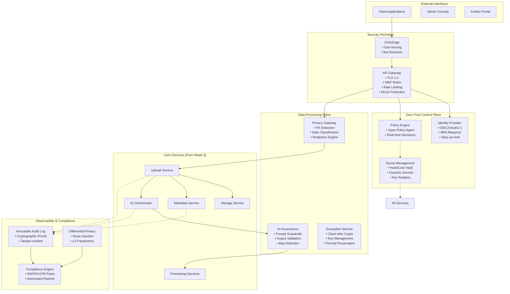

# `architecture_specification.md`

# Week 04: Secure Governance Architecture Specification

## Executive Summary
This document outlines the architecture for transitioning from a functional microservices ecosystem (Weeks 1-3) to a secure, governed, zero-trust system compliant with modern privacy regulations.

## 1. Architectural Vision

### 1.1 Core Philosophy
**Defense in Depth with Privacy by Default**: Every layer of the system assumes breach and implements verification. Privacy is not an afterthought but a foundational design principle.

### 1.2 Target State
A system where:
- No service implicitly trusts another
- Data is encrypted in transit, at rest, and often in use
- Every access decision is logged and auditable
- Users control their data through self-service portals
- AI operations are transparent and ethical

## 2. Reference Architecture

### 2.1 High-Level Architecture


## 3. Component Specifications

### 3.1 Identity & Access Management Layer

#### 3.1.1 Identity Provider
- **Protocol**: OIDC/OAuth 2.1 with PKCE
- **Authentication**: Multi-factor required for admin access
- **Session Management**: Short-lived tokens (15min) with refresh rotation
- **Step-up Authentication**: Required for sensitive operations
- **Implementation**: Keycloak with custom authenticators

#### 3.1.2 Policy Engine (Open Policy Agent)
```rego
# Example: File Access Policy
package file_access

import rego.v1

default allow := false

# Users can access their own files
allow if {
    input.method == "GET"
    input.path = ["files", file_id]
    input.user.roles[_] == "user"
    data.files[file_id].owner == input.user.id
}

# Admins can access all files with logging
allow if {
    input.method == "GET"
    input.user.roles[_] == "admin"
    audit_log("admin_access", input)
}

# AI services can only access processed files
allow if {
    input.method == "GET"
    input.service.type == "ai_processor"
    data.files[file_id].status == "processed"
    not contains_sensitive_data(file_id)
}
```

### 3.2 Data Privacy Layer

#### 3.2.1 Privacy Gateway
**Responsibilities**:
1. Real-time PII detection using ML models
2. Data classification (Public, Internal, Confidential, Restricted)
3. Automatic redaction based on user consent and data classification
4. Data minimization enforcement

**Technical Stack**:
- **Detection**: Microsoft Presidio with custom detectors
- **Classification**: Trained BERT model for document classification
- **Redaction**: Format-preserving encryption for structured data
- **Performance**: Async processing with Redis queue

#### 3.2.2 Encryption Service
- **At-rest**: AES-256-GCM with per-file keys
- **In-transit**: TLS 1.3 with forward secrecy
- **In-use**: Client-side encryption for sensitive operations
- **Key Management**: AWS KMS with envelope encryption pattern
- **Key Rotation**: Automatic 90-day rotation with re-encryption

### 3.3 Network Security Layer

#### 3.3.1 Service Mesh (Istio)
```yaml
apiVersion: security.istio.io/v1beta1
kind: PeerAuthentication
metadata:
  name: default
spec:
  mtls:
    mode: STRICT
---
apiVersion: security.istio.io/v1beta1
kind: AuthorizationPolicy
metadata:
  name: service-to-service
spec:
  action: ALLOW
  rules:
  - from:
    - source:
        principals: ["cluster.local/ns/default/sa/upload-service"]
    to:
    - operation:
        methods: ["POST"]
        paths: ["/api/v1/process"]
```

#### 3.3.2 API Gateway Security
- **WAF Rules**: OWASP Core Rule Set + custom rules
- **Rate Limiting**: Token bucket algorithm per user/service
- **DDoS Protection**: Automated IP blocking + challenge-response
- **Bot Detection**: JA3 fingerprinting + behavioral analysis

### 3.4 Audit & Compliance Layer

#### 3.4.1 Immutable Audit Log
**Design Principles**:
1. **Append-only**: No updates or deletes
2. **Cryptographically linked**: Each entry references previous hash
3. **Tamper-evident**: Any modification breaks hash chain
4. **Queryable**: Efficient time-range and entity-based queries

**Implementation**:
```go
type AuditEntry struct {
    ID          string    `json:"id"`
    Timestamp   time.Time `json:"timestamp"`
    Actor       Actor     `json:"actor"`
    Action      string    `json:"action"`
    Resource    string    `json:"resource"`
    Changes     []Change  `json:"changes,omitempty"`
    PreviousHash string   `json:"previous_hash"`
    CurrentHash  string   `json:"current_hash"`
    Signature   string    `json:"signature"` // Digital signature
}

// Merkle tree for efficient proof generation
type AuditMerkleTree struct {
    RootHash string
    Leaves   []AuditEntry
    Period   time.Duration // e.g., hourly trees
}
```

#### 3.4.2 Differential Privacy Engine
```python
class DifferentialPrivacyEngine:
    def __init__(self, epsilon=0.5, delta=1e-5):
        self.epsilon = epsilon
        self.delta = delta
    
    def add_noise(self, data, sensitivity):
        """Add Laplace noise for count queries"""
        scale = sensitivity / self.epsilon
        noise = np.random.laplace(0, scale)
        return data + noise
    
    def report_noisy_max(self, counts):
        """Report noisy maximum for privacy-preserving analytics"""
        noisy_counts = [c + np.random.laplace(0, 1/self.epsilon) 
                       for c in counts]
        return np.argmax(noisy_counts)
```

### 3.5 AI Governance Layer

#### 3.5.1 Content Moderation Pipeline
```
Input → [Toxicity Filter] → [Bias Detector] → [Prompt Sanitizer] → LLM
                             ↓
                     [Bias Mitigation]
                             ↓
                     [Fairness Metrics]
```

#### 3.5.2 Ethical Guidelines Enforcement
- **Transparency**: All AI decisions logged with confidence scores
- **Explainability**: LIME/SHAP explanations for critical decisions
- **Human-in-the-loop**: Required for high-risk classifications
- **Bias Monitoring**: Continuous A/B testing for demographic parity

## 4. Data Flow Specifications

### 4.1 File Upload with Privacy Protection
```
1. Client → [TLS Handshake] → API Gateway
2. API Gateway → [Authentication] → Identity Provider
3. API Gateway → [Authorization Check] → Policy Engine
4. Client → [Privacy Gateway] → File + Metadata
5. Privacy Gateway → [PII Detection] → Classification Result
6. Privacy Gateway → [Redaction if needed] → Encrypted Storage
7. Storage Service → [Audit Log] → Immutable Store
8. Return → [File ID + Access Token] → Client
```

### 4.2 Cross-Service Communication
```
Service A → [mTLS Handshake] → Service B
          → [Service Account Token] → Policy Engine
          → [Dynamic Secrets] → Vault
          → [Encrypted Payload] → Service B
          → [Audit Entry] → Compliance Layer
```

## 5. Non-Functional Requirements

### 5.1 Security Requirements
- **Authentication**: 99.99% uptime, <100ms latency
- **mTLS**: All internal traffic encrypted, <5ms overhead
- **Audit**: Complete trail, <50ms logging latency
- **Compliance**: GDPR/CCPA ready, automated reporting

### 5.2 Performance Requirements
- **Privacy Processing**: <500ms overhead for PII detection
- **Policy Decisions**: <10ms latency at p99
- **Encryption**: <100ms for client-side encryption
- **Audit Queries**: <1s for 30-day history

### 5.3 Scalability Requirements
- **Peak Load**: 10,000 requests/second
- **Data Volume**: 100TB storage, 1M files/day
- **Geographic**: Multi-region deployment capability
- **Growth**: 50% year-over-year capacity increase

## 6. Compliance Framework

### 6.1 Regulatory Mapping
| Requirement | Implementation | Verification |
|------------|---------------|--------------|
| GDPR Art. 5 | Data minimization in Privacy Gateway | Automated scans |
| GDPR Art. 17 | Right to erasure in Metadata Service | API testing |
| CCPA §1798.100 | Data access reports | Compliance dashboard |
| HIPAA §164.312 | Audit controls | Penetration testing |
| SOC 2 Type II | Security monitoring | Quarterly audits |

### 6.2 Evidence Generation
- **Automated Reports**: Daily compliance status
- **Audit Trails**: Cryptographically verifiable
- **Consent Records**: User preferences with timestamps
- **Data Maps**: Automated data lineage visualization

## 7. Risk Management

### 7.1 Identified Risks
1. **Key Management**: Centralized failure point
2. **Performance Impact**: Privacy processing overhead
3. **False Positives**: Over-redaction of data
4. **Audit Log Growth**: Storage requirements
5. **Regulatory Changes**: Requirement evolution

### 7.2 Mitigation Strategies
- **Key Management**: Multi-region, offline backup keys
- **Performance**: Progressive enhancement, caching
- **Accuracy**: Human review queue for edge cases
- **Storage**: Tiered storage with hot/warm/cold
- **Compliance**: Policy as code with version control

## 8. Deployment Architecture

### 8.1 Environment Strategy
- **Development**: Full security with debug capabilities
- **Staging**: Identical to production, synthetic data
- **Production**: Zero debugging, full monitoring
- **Compliance**: Isolated environment for auditor access

### 8.2 Disaster Recovery
- **RTO**: 4 hours for full recovery
- **RPO**: 15 minutes data loss maximum
- **Backup Strategy**: Encrypted, geographically distributed
- **Failover**: Automated regional failover

## 9. Success Metrics

### 9.1 Security Metrics
- Mean Time to Detect (MTTD): <5 minutes
- Mean Time to Respond (MTTR): <30 minutes
- Policy Violations: <0.1% of requests
- Audit Coverage: 100% of privileged actions

### 9.2 Privacy Metrics
- PII Detection Accuracy: >95% recall, >99% precision
- False Positive Rate: <1%
- Consent Compliance: 100% of user preferences honored
- Data Minimization: >90% reduction in stored PII

### 9.3 Performance Metrics
- Privacy Processing Overhead: <10% increase in latency
- Policy Decision Time: <20ms p99
- Audit Query Performance: <2s for complex queries
- System Availability: 99.95% uptime

---